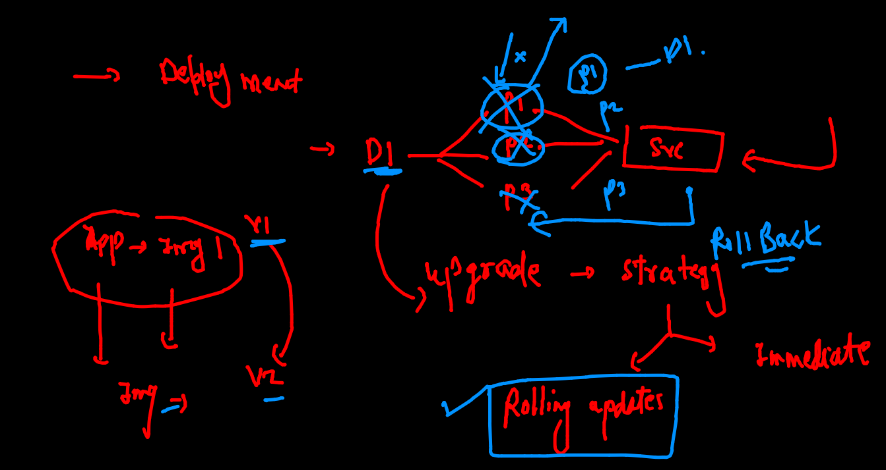
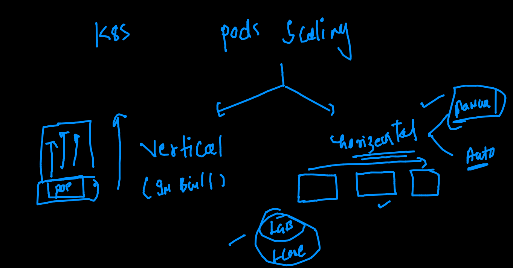
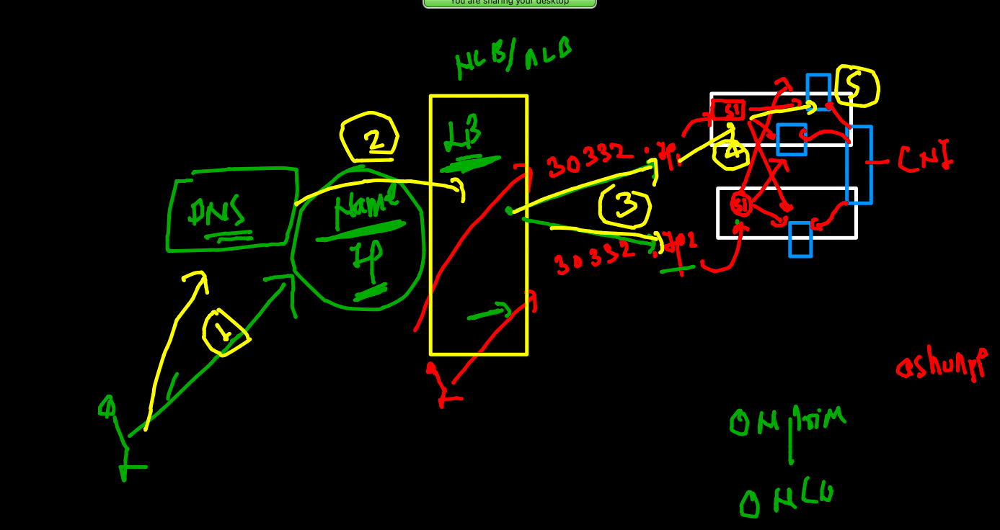
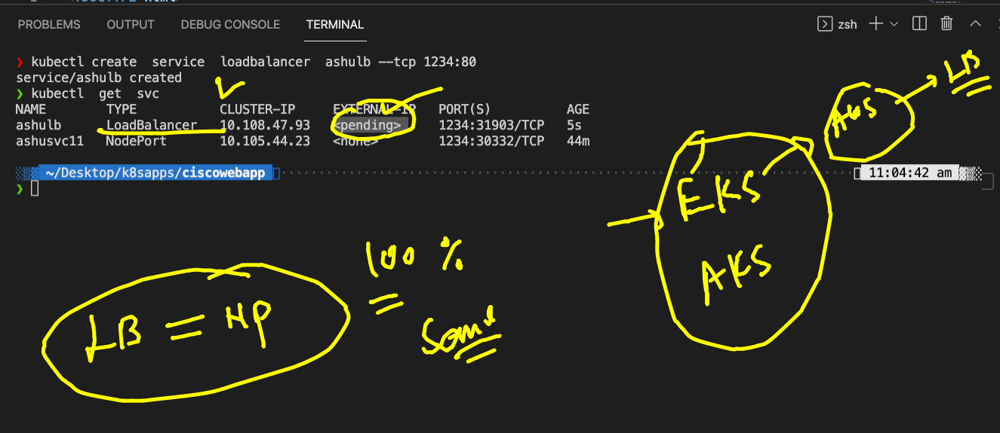
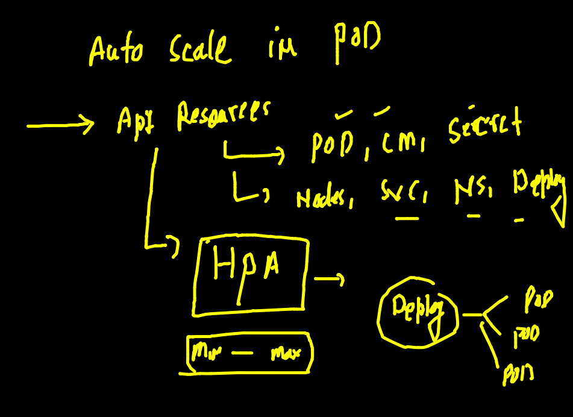
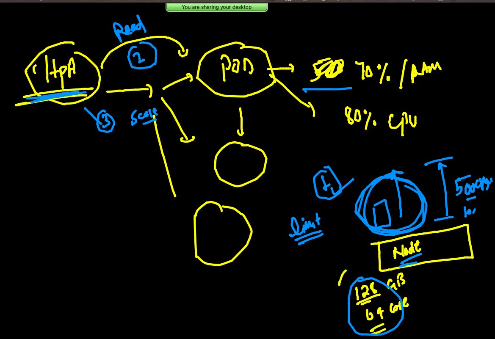

# training plan 


## Deployment 



### building sample web app calling it v1 

```
❯ docker  build  -t dockerashu/ciscowebapp:v0011  .
[+] Building 12.7s (5/7)                                                                                  
 => [internal] load build definition from Dockerfile                                                 0.2s
 => => transferring dockerfile: 92B                                                                  0.0s
 => [internal] load .dockerignore                                                                    0.2s
 => => transferring context: 2B                                                                      0.0s
 => [internal] load metadata for docker.io/library/nginx:latest                                      4.6s
 => [auth] library/nginx:pull token for registry-1.docker.io                                         0.0s
 => [internal] load build context                                                                    0.1s
 => => transferring context: 418B                                                                    0.0s
 => [1/2] FROM docker.io/library/nginx@sha256:e5c237fda6556a74408af0e8126aaf34812160722f0a24a01d583  7.6s
 => => resolve docker.io/library/nginx@sha256:e5c237fda6556a74408af0e8126aaf34812160722f0a24a01d583  0.0s
 => => sha256:e5c237fda6556a74408af0e8126aaf34812160722f0a24a01d58301e014fa98c 1.86kB / 1.86kB       0.0s
 => => sha256:dd34e67e3371dc2d1328790c3157ee42dfcae74afffd86b297459ed87a98c0fb 7.73kB / 7.73kB       0.0s
 => => sha256:e1acddbe380c63f0de4b77d3f287b7c81cd9d89563a230692378126b46ea6546 20.97MB / 27.15MB     7.5s
 => => sha256:5e95e5eb8be4322e3b3652d737371705e56809ed8b307ad68ec59ddebaaf60e4 1.57kB / 1.57kB       0.0s
 => => sha256:f3341cc17e586daa96
 
 
 ```
 
 ### pushing image 
 
 ```
 ❯ docker  images
REPOSITORY                    TAG       IMAGE ID       CREATED          SIZE
dockerashu/ciscowebapp        v0011     c9e0125a845a   11 seconds ago   133MB
gcr.io/k8s-minikube/kicbase   v0.0.25   8768eddc4356   2 months ago     1.1GB
❯ docker login -u dockerashu
Password: 
Login Succeeded
❯ docker push  dockerashu/ciscowebapp:v0011
The push refers to repository [docker.io/dockerashu/ciscowebapp]
93453793489a: Pushing  4.096kB
fb04ab8effa8: Preparing 
8f736d52032f: Preparing 
009f1d338b57: Preparing 

```

### creating yaml 

```
3694  kubectl  create  deployment  ashuwebapp --image=dockerashu/ciscowebapp:v0011  --dry-run=client -o yaml 
❯ kubectl  create  deployment  ashuwebapp --image=dockerashu/ciscowebapp:v0011  --dry-run=client -o yaml  >rolling.yaml

```

### creating service 

```
kubectl   create  service nodeport ashusvc11 --tcp 1234:80 --dry-run=client -o yaml
apiVersion: v1
kind: Service
metadata:
  creationTimestamp: null
  labels:
    app: ashusvc11
  name: ashusvc11
spec:
  ports:
  - name: 1234-80
    port: 1234
    protocol: TCP
    targetPort: 80
  selector:
    app: ashusvc11
  type: NodePort
status:
  loadBalancer: {}
  
  
```

### finally deploy -- app 

```
❯ kubectl  apply -f  rolling.yaml
deployment.apps/ashuwebapp created
service/ashusvc11 created
❯ kubectl  get deployment
NAME         READY   UP-TO-DATE   AVAILABLE   AGE
ashuwebapp   1/1     1            1           8s
❯ kubectl  get  po
NAME                         READY   STATUS    RESTARTS   AGE
ashuwebapp-758654b4f-9ffdz   1/1     Running   0          14s
❯ kubectl  get  svc
NAME        TYPE       CLUSTER-IP     EXTERNAL-IP   PORT(S)          AGE
ashusvc11   NodePort   10.105.44.23   <none>        1234:30332/TCP   17s


```

### POd scaling in k8s 



### horizontal manual scaling 

```
❯ kubectl   get  deploy
NAME         READY   UP-TO-DATE   AVAILABLE   AGE
ashuwebapp   1/1     1            1           8m2s
❯ kubectl  scale  deploy ashuwebapp  --replicas=3
deployment.apps/ashuwebapp scaled
❯ kubectl   get  deploy
NAME         READY   UP-TO-DATE   AVAILABLE   AGE
ashuwebapp   3/3     3            3           8m22s
❯ kubectl  get  po
NAME                         READY   STATUS    RESTARTS   AGE
ashuwebapp-758654b4f-9ffdz   1/1     Running   0          8m33s
ashuwebapp-758654b4f-d4tg4   1/1     Running   0          15s
ashuwebapp-758654b4f-vvx8p   1/1     Running   0          15s


```

### End to end app 



### updata app 

```
❯ docker  build  -t dockerashu/ciscowebapp:v0022  .
[+] Building 4.0s (8/8) FINISHED                                                                          
 => [internal] load build definition from Dockerfile                                                 0.1s
 => => transferring dockerfile: 36B                                                                  0.1s
 => [internal] load .dockerignore                                                                    0.1s
 => => transferring context: 2B                                                                      0.0s
 => [internal] load metadata for docker.io/library/nginx:latest                                      3.1s
 => [auth] library/nginx:pull token for registry-1.docker.io                                         0.0s
 => [internal] load build context                                                                    0.1s
 => => transferring context: 483B                                                                    0.0s
 => CACHED [1/2] FROM docker.io/library/nginx@sha256:e5c237fda6556a74408af0e8126aaf34812160722f0a24  0.0s
 => [2/2] COPY index.html /usr/share/nginx/html/                                                     0.1s
 => exporting to image                                                                               0.1s
 => => exporting layers                                                                              0.1s
 => => writing image sha256:769c459b7f5fd526951ace77781c7da37f6012f6dfe769bb7415be0c27156b57         0.0s
 => => naming to docker.io/dockerashu/ciscowebapp:v0022                                              0.0s
❯ docker push  dockerashu/ciscowebapp:v0022
The push refers to repository [docker.io/dockerashu/ciscowebapp]
f3961d0e0cbc: Pushing  4.096kB
fb04ab8effa8: Layer already exists 
8f736d52032f: Layer already exists 
009f1d338b57: Layer already exists 
678bbd796838: Layer already exists 

```

### updating image in deployment 

```
❯ kubectl  get deploy
NAME         READY   UP-TO-DATE   AVAILABLE   AGE
ashuwebapp   3/3     3            3           32m
❯ kubectl  set  image  deploy  ashuwebapp  ciscowebapp=dockerashu/ciscowebapp:v0022
deployment.apps/ashuwebapp image updated
❯ kubectl  get  po
NAME                         READY   STATUS    RESTARTS   AGE
ashuwebapp-8d667dcc9-4lzxq   1/1     Running   0          27s
ashuwebapp-8d667dcc9-f8rsc   1/1     Running   0          22s
ashuwebapp-8d667dcc9-fxm2m   1/1     Running   0          25s

```

### reality of Loadbalancer. service 



### auto scaling in POD 



### hap conditions 



