# training plan 


# Docker revision 


## Docker compose file version discussion 

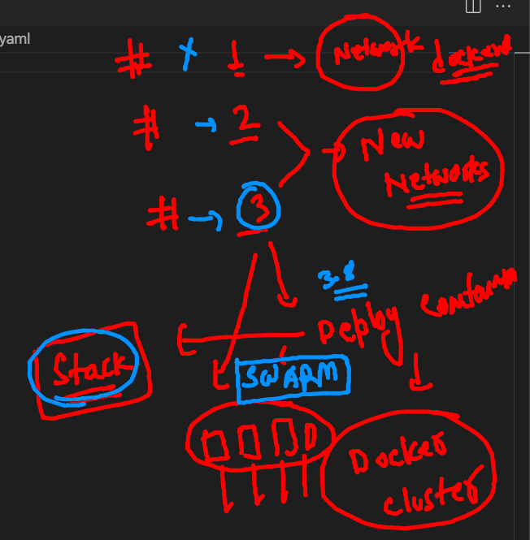

## Cleaning up docker engine 

```
282  docker  rmi $(docker  images -q)
  283  docker  rmi $(docker  images -q) -f
  284  docker  ps  -a
  285  docker  images
  286  docker  network  ls
  287  docker  volume ls
  288  docker  volume ls  -q
  289  docker  volume  rm $(docker  volume ls  -q)
  290  docker  volume ls
  
```

## COmpose example 1 

```
[ashu@ip-172-31-29-98 ashucompose1]$ docker-compose up -d 
Creating network "ashucompose1_default" with the default driver
Pulling ashuapp1 (alpine:)...
latest: Pulling from library/alpine
a0d0a0d46f8b: Downloading [>                                                  ]  33.32kB/2.814a0d0a0d46f8b: Downloading [==================================================>]  2.814MB/2.814a0d0a0d46f8b: Extracting [>                                                  ]  32.77kB/2.814Ma0d0a0d46f8b: Extracting [=============>                                     ]  753.7kB/2.814Ma0d0a0d46f8b: Extracting [==================================================>]  2.814MB/2.814Ma0d0a0d46f8b: Extracting [==================================================>]  2.814MB/2.814Ma0d0a0d46f8b: Pull complete
Digest: sha256:e1c082e3d3c45cccac829840a25941e679c25d438cc8412c2fa221cf1a824e6a
Status: Downloaded newer image for alpine:latest
Creating ashuc1 ... done

```

### more compose commands 

```
 298  docker-compose up -d 
  299  docker-compose  ps
  300  docker-compose  images
  301  docker-compose  logs 
  302  history 
[ashu@ip-172-31-29-98 ashucompose1]$ docker-compose  ps
 Name       Command       State   Ports
---------------------------------------
ashuc1   ping localhost   Up           
[ashu@ip-172-31-29-98 ashucompose1]$ docker-compose  images
Container   Repository    Tag       Image Id       Size  
---------------------------------------------------------
ashuc1      alpine       latest   14119a10abf4   5.595 MB

===

ashu@ip-172-31-29-98 ashucompose1]$ docker-compose  stop 
Stopping ashuc1 ... done
[ashu@ip-172-31-29-98 ashucompose1]$ docker-compose  ps
 Name       Command        State     Ports
------------------------------------------
ashuc1   ping localhost   Exit 137        
[ashu@ip-172-31-29-98 ashucompose1]$ docker-compose  start
Starting ashuapp1 ... done
[ashu@ip-172-31-29-98 ashucompose1]$ docker-compose  ps
 Name       Command       State   Ports
---------------------------------------
ashuc1   ping localhost   Up           
[ashu@ip-172-31-29-98 ashucompose1]$ docker-compose  kill 
Killing ashuc1 ... done
[ashu@ip-172-31-29-98 ashucompose1]$ docker-compose  ps
 Name       Command        State     Ports
------------------------------------------
ashuc1   ping localhost   Exit 137        

```

### help in compose 

```
ashu@ip-172-31-29-98 ashucompose1]$ mv  docker-compose.yaml   a.ym
[ashu@ip-172-31-29-98 ashucompose1]$ ls
a.ym
[ashu@ip-172-31-29-98 ashucompose1]$ docker-compose ps 
ERROR: 
        Can't find a suitable configuration file in this directory or any
        parent. Are you in the right directory?

        Supported filenames: docker-compose.yml, docker-compose.yaml, compose.yml, compose.yaml
        
[ashu@ip-172-31-29-98 ashucompose1]$ docker-compose -f  a.ym  ps
 Name       Command        State     Ports
------------------------------------------
ashuc1   ping localhost   Exit 137    

```

### remove components in compose 

```
[ashu@ip-172-31-29-98 ashucompose1]$ docker-compose down 
Removing ashuc1 ... done
Removing network ashucompose1_default

```

### Compose example 2 

```
version: '3.8' # compose file version 
services:
 ashuapp2:
  image: centos
  command: ping fb.com 
 ashuapp1:
  image: alpine
  container_name: ashuc1
  command: ping localhost 
  
```

### up 

```
[ashu@ip-172-31-29-98 ashucompose1]$ docker-compose -f  example2.yaml up  -d 
Creating network "ashucompose1_default" with the default driver
Creating ashucompose1_ashuapp2_1 ... done
Creating ashuc1                  ... done
[ashu@ip-172-31-29-98 ashucompose1]$ docker-compose -f  example2.yaml  ps
         Name                Command       State   Ports
--------------------------------------------------------
ashuc1                    ping localhost   Up           
ashucompose1_ashuapp2_1   ping fb.com      Up 

```

### more commands 

```
[ashu@ip-172-31-29-98 ashucompose1]$ docker-compose -f  example2.yaml  ps ashuapp1
 Name       Command       State   Ports
---------------------------------------
ashuc1   ping localhost   Up           
[ashu@ip-172-31-29-98 ashucompose1]$ docker-compose -f  example2.yaml kill ashuapp1
Killing ashuc1 ... done
[ashu@ip-172-31-29-98 ashucompose1]$ docker-compose -f  example2.yaml  ps
         Name                Command        State     Ports
-----------------------------------------------------------
ashuc1                    ping localhost   Exit 137        
ashucompose1_ashuapp2_1   ping fb.com      Up              
[ashu@ip-172-31-29-98 ashucompose1]$ docker-compose -f  example2.yaml  down
Stopping ashucompose1_ashuapp2_1 ... done
Removing ashucompose1_ashuapp2_1 ... done
Removing ashuc1                  ... done
Removing network ashucompose1_default

```

### Example 3 for compose 

### httpd vs nginx 


##

```
[ashu@ip-172-31-29-98 ashucompose1]$ docker-compose -f example3.yaml up -d 
Creating network "ashucompose1_default" with the default driver
Building ashuapp1
Sending build context to Docker daemon  260.6kB
Step 1/3 : FROM nginx
 ---> dd34e67e3371
Step 2/3 : LABEL email=ashutoshh@linux.com
 ---> Running in edf50352a7df
Removing intermediate container edf50352a7df
 ---> ac90f611dd80
Step 3/3 : COPY  webapp /usr/share/nginx/html/
 ---> 7e134dd0dd83
Successfully built 7e134dd0dd83
Successfully tagged cisocweb:ashuv111
WARNING: Image for service ashuapp1 was built because it did not already exist. To rebuild this image you must use `docker-compose build` or `docker-compose up --build`.
Creating ashuc1 ... done

```

## to build image everytime 

```
[ashu@ip-172-31-29-98 ashucompose1]$ docker-compose -f example3.yaml up -d --build
Creating network "ashucompose1_default" with the default driver
Building ashuapp1
Sending build context to Docker daemon  260.6kB
Step 1/3 : FROM nginx
 ---> dd34e67e3371
Step 2/3 : LABEL email=ashutoshh@linux.com
 ---> Using cache
 ---> ac90f611dd80
Step 3/3 : COPY  webapp /usr/share/nginx/html/
 ---> f42ecf250197
Successfully built f42ecf250197
Successfully tagged cisocweb:ashuv111
Creating ashuc1 ... done


```

###  figureout problem and solution 

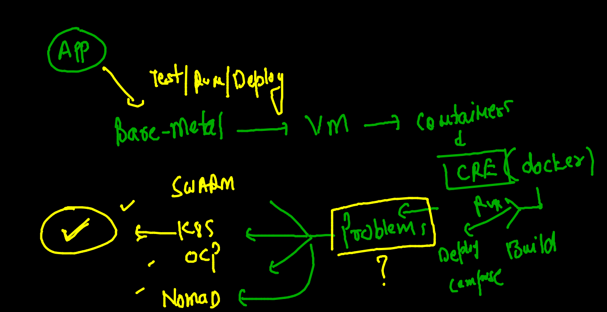

### COntainer management prob 


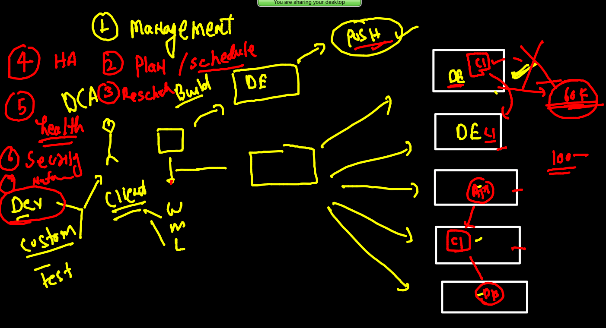

### Intro to k8s 

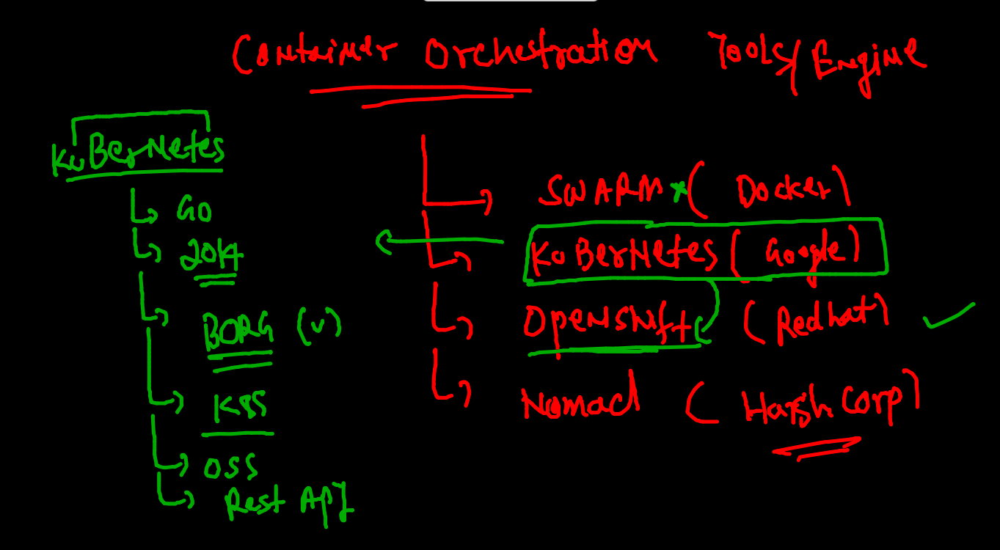

## Understanding k8s plan and arch 

### arch L1 

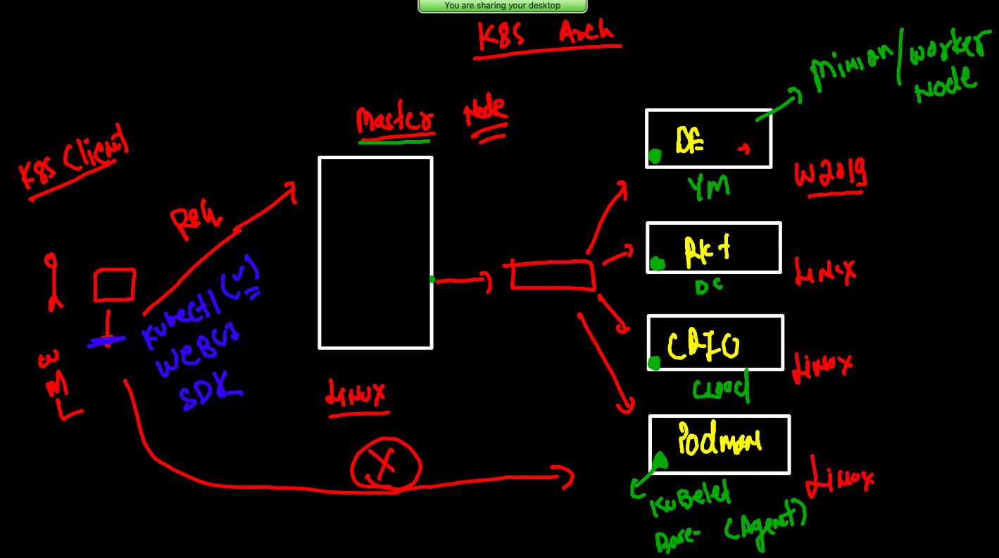

### kube-apiserver in Master node 

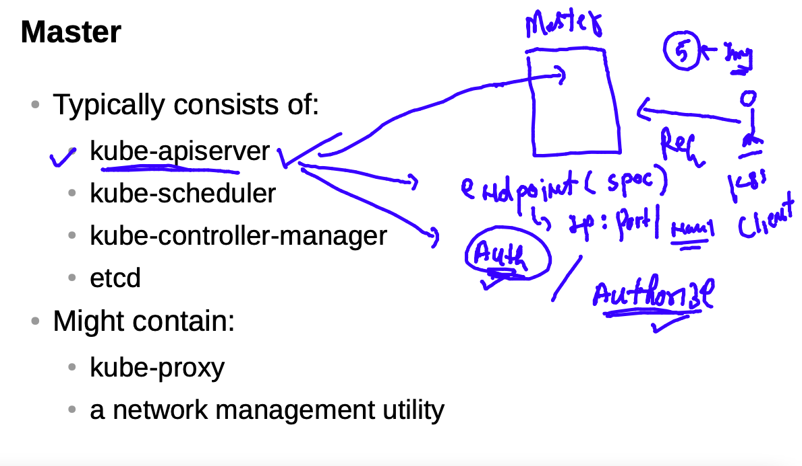

### kube-schedular 

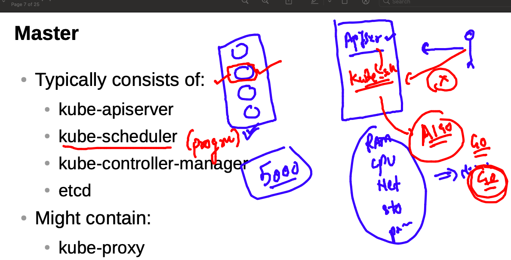

### kube-controller -manager

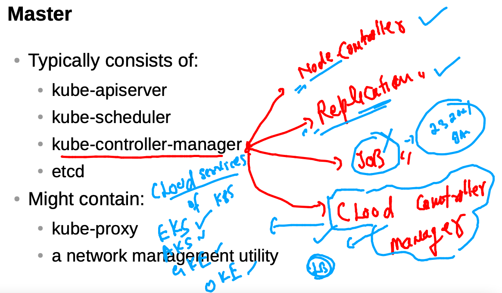

### ETCD in master node

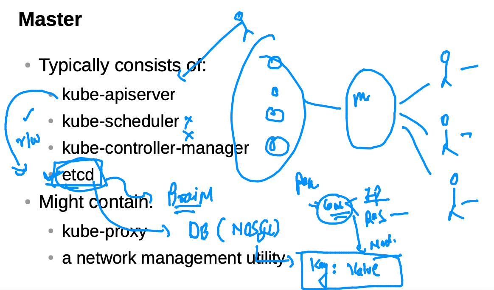


### k8s cluster deployment methods 


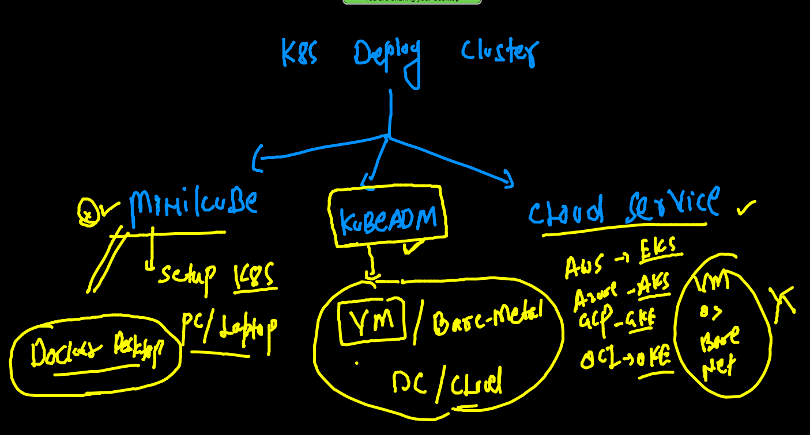

### Minikube all the way 

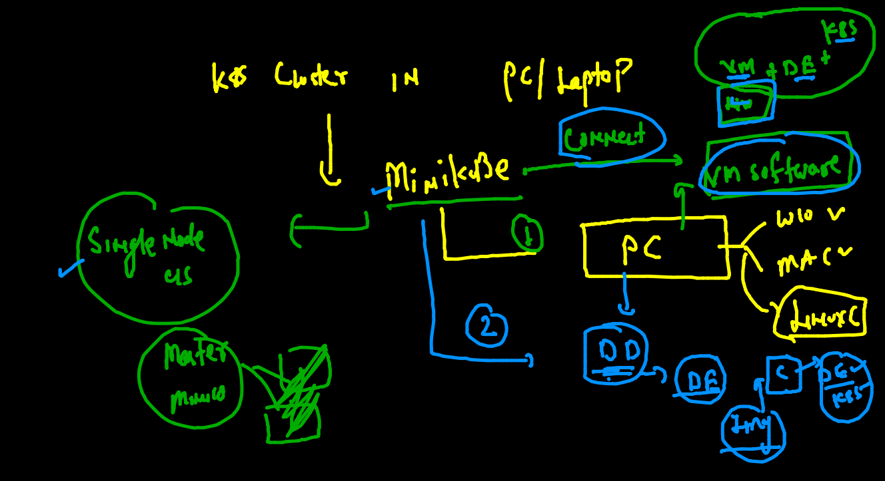

### Minikube Installation 


[page link]('https://minikube.sigs.k8s.io/docs/start/')

## create cluster using minikube 

```
❯ minikube version
minikube version: v1.22.0
commit: a03fbcf166e6f74ef224d4a63be4277d017bb62e

❯ minikube  start --driver=docker
😄  minikube v1.22.0 on Darwin 11.4
✨  Using the docker driver based on existing profile
👍  Starting control plane node minikube in cluster minikube
🚜  Pulling base image ...
🤷  docker "minikube" container is missing, will recreate.
🔥  Creating docker container (CPUs=2, Memory=1988MB) ...
🐳  Preparing Kubernetes v1.21.2 on Docker 20.10.7 ...
🔎  Verifying Kubernetes components...
    ▪ Using image gcr.io/k8s-minikube/storage-provisioner:v5
🌟  Enabled addons: default-storageclass
🏄  Done! kubectl is now configured to use "minikube" cluster and "default" namespace by default


```

###  checking minikube cluster status

```
❯ minikube status
minikube
type: Control Plane
host: Running
kubelet: Running
apiserver: Running
kubeconfig: Configured

===

❯ minikube stop
✋  Stopping node "minikube"  ...
🛑  Powering off "minikube" via SSH ...


===


❯ minikube  ssh
docker@minikube:~$ 
docker@minikube:~$ 
docker@minikube:~$ 
docker@minikube:~$ exit
logout


```

### checking k8s client software 

```
❯ kubectl   version  --client
Client Version: version.Info{Major:"1", Minor:"21", GitVersion:"v1.21.1", GitCommit:"5e58841cce77d4bc13713ad2b91fa0d961e69192", GitTreeState:"clean", BuildDate:"2021-05-12T14:18:45Z", GoVersion:"go1.16.4", Compiler:"gc", Platform:"darwin/amd64"}

```

### checking nodes in k8s 

```
❯ kubectl  get  nodes
NAME       STATUS   ROLES                  AGE   VERSION
minikube   Ready    control-plane,master   20d   v1.21.2

```

### deploy contianer in k8s 

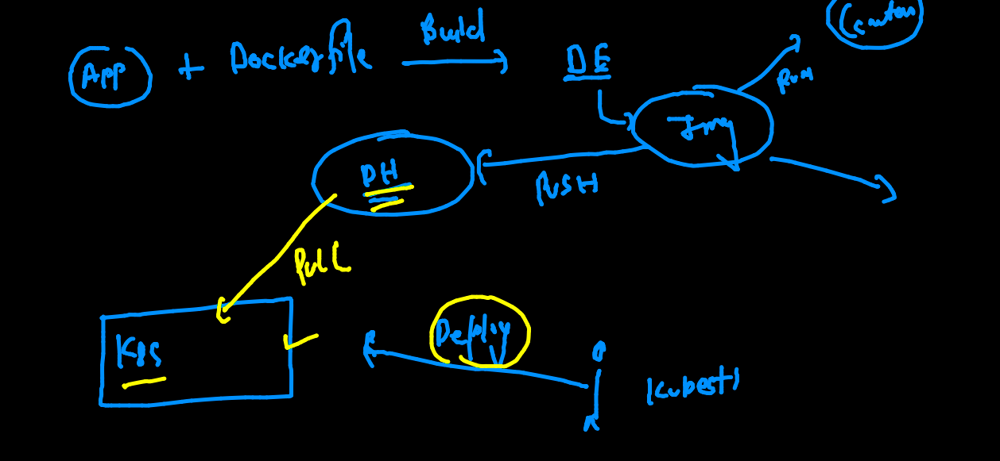

### k8s deploy docker img in form of POds 


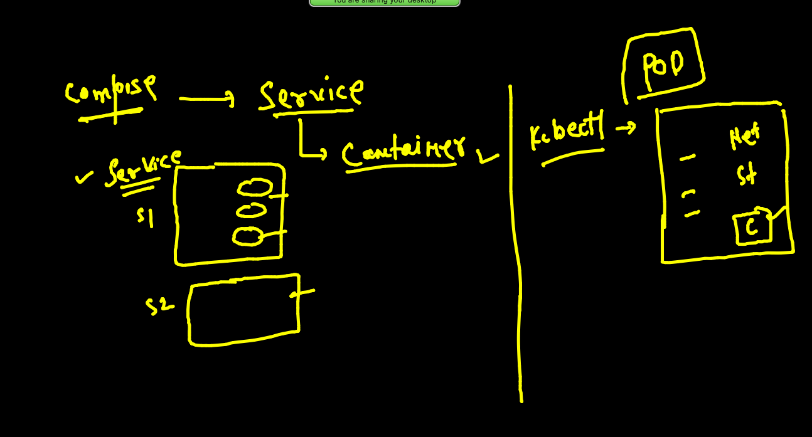

### Contianer vs POd 

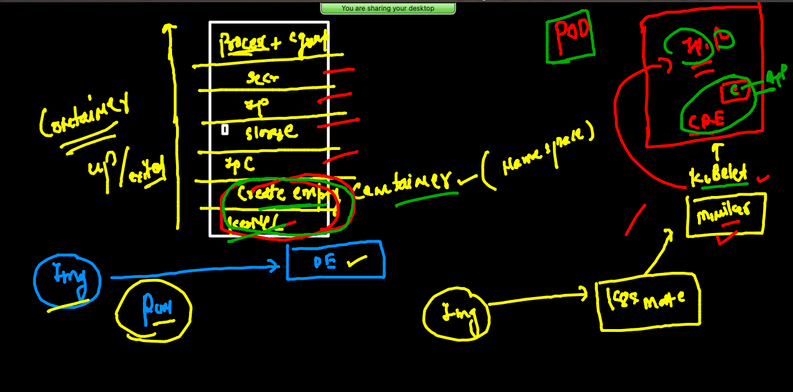

### creating POD 

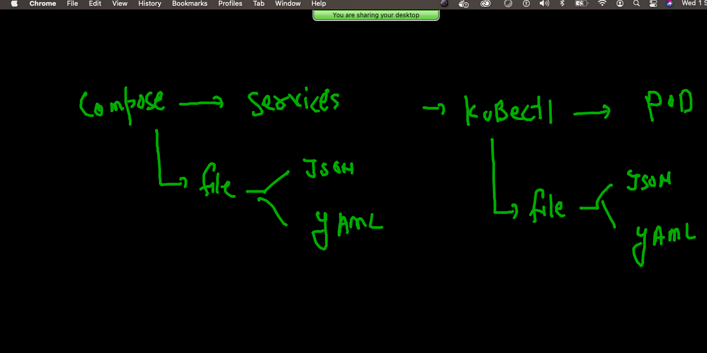

### pod cmd and entrypoint discussion 

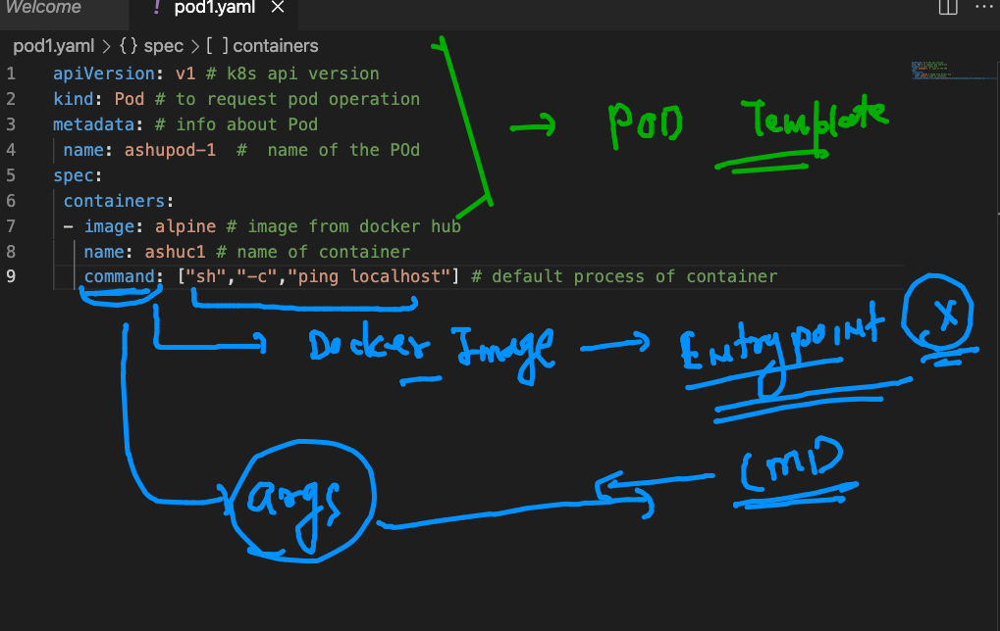

### checking syntx 

```
❯ ls
pod1.yaml
❯ kubectl  apply  -f  pod1.yaml  --dry-run=client
pod/ashupod-1 created (dry run)

```

### creating pod 

```
❯ kubectl  apply  -f  pod1.yaml
pod/ashupod-1 created
❯ kubectl  get  pods
NAME        READY   STATUS              RESTARTS   AGE
ashupod-1   0/1     ContainerCreating   0          13s

```

### checking running pods logs

```
❯ kubectl  logs  -f  ashupod-1
PING localhost (127.0.0.1): 56 data bytes
64 bytes from 127.0.0.1: seq=0 ttl=64 time=0.082 ms
64 bytes from 127.0.0.1: seq=1 ttl=64 time=0.114 ms
64 bytes from 127.0.0.1: seq=2 ttl=64 time=0.337 ms
64 bytes from 127.0.0.1: seq=3 ttl=64 time=0.094 ms

```

### checking details of POD 

```
❯ kubectl  describe  pod  ashupod-1
Name:         ashupod-1
Namespace:    default
Priority:     0
Node:         minikube/192.168.49.2
Start Time:   Wed, 01 Sep 2021 15:15:34 +0530
Labels:       <none>
Annotations:  <none>
Status:       Running
IP:           172.17.0.3
IPs:
  IP:  172.17.0.3
Containers:
  ashuc1:
    Container ID:  docker://6204235e6603f516574fb37e2d111d86f78f6ee390567f29b575b8a863b0138f
    Image:         alpine
    Image ID:      docker-pullable://alpine@sha256:e1c082e3d3c45cccac829840a25941e679c25d438cc8412c2fa221cf1a824e6a
    Port:          <none>
    Host Port:     <none>
    Command:
      sh
      -c
      ping localhost

```


### deleting pod 

```
❯ kubectl  delete  pod  ashupod-1
pod "ashupod-1" deleted


```

### access container inside pod 

```
 kubectl  exec  -it  ashupod-1    -- sh
/ # 
/ # 
/ # cat  /etc/os-release 
NAME="Alpine Linux"
ID=alpine
VERSION_ID=3.14.2
PRETTY_NAME="Alpine Linux v3.14"
HOME_URL="https://alpinelinux.org/"
BUG_REPORT_URL="https://bugs.alpinelinux.org/"
/ # exit

```


###  kubectl to connect or switch multiple cluster 

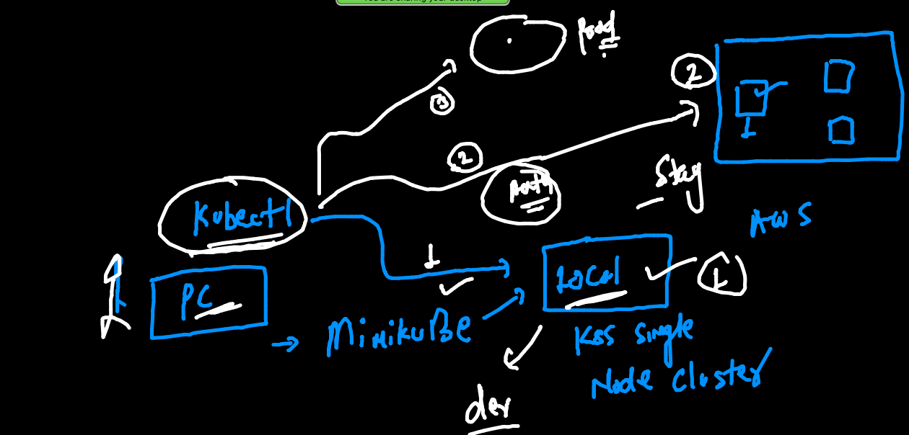

### to connect any k8s cluster we need auth file 

```
[root@masternode ~]# cd   /etc/kubernetes/
[root@masternode kubernetes]# ls
admin.conf 

```

### connecting k8s using auth file 

```
❯ kubectl   get  nodes   --kubeconfig=admin.conf
NAME         STATUS   ROLES                  AGE     VERSION
masternode   Ready    control-plane,master   10m     v1.22.1
minion1      Ready    <none>                 9m43s   v1.22.1
minion2      Ready    <none>                 9m49s   v1.22.1

```

### merging two k8s cluster auth file into single one 

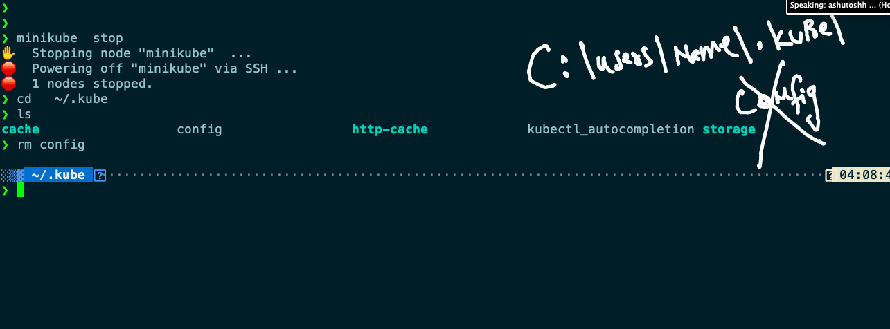

### in any os under home directory copy auth file by the name of config 

```
❯ cp  -v  ~/Desktop/admin.conf  ./config
/Users/fire/Desktop/admin.conf -> ./config
❯ ls
cache                  config                 http-cache             kubectl_autocompletion storage

```

### swithcing context 

```
❯ kubectl   config  get-contexts
CURRENT   NAME                          CLUSTER      AUTHINFO           NAMESPACE
          kubernetes-admin@kubernetes   kubernetes   kubernetes-admin   
*         minikube                      minikube     minikube           default
❯ kubectl  get   nodes
NAME       STATUS   ROLES                  AGE   VERSION
minikube   Ready    control-plane,master   21d   v1.21.2
❯ 
❯ 
❯ kubectl   config  use-context   kubernetes-admin@kubernetes
Switched to context "kubernetes-admin@kubernetes".
❯ kubectl   config  get-contexts
CURRENT   NAME                          CLUSTER      AUTHINFO           NAMESPACE
*         kubernetes-admin@kubernetes   kubernetes   kubernetes-admin   
          minikube                      minikube     minikube           default
❯ kubectl  get   nodes
NAME         STATUS   ROLES                  AGE   VERSION
masternode   Ready    control-plane,master   19m   v1.22.1
minion1      Ready    <none>                 19m   v1.22.1
minion2      Ready    <none>                 19m   v1.22.1

```

### checking pod scheduling node 

```
❯ kubectl  get  po  -o wide
NAME        READY   STATUS    RESTARTS   AGE   IP                NODE      NOMINATED NODE   READINESS GATES
alwth-1     1/1     Running   0          30s   192.168.34.4      minion1   <none>           <none>
ashupod-1   1/1     Running   0          66s   192.168.179.193   minion2   <none>           <none>
debapod-1   1/1     Running   0          36s   192.168.179.195   minion2   <none>           <none>
rubipod-1   1/1     Running   0          61s   192.168.179.194   minion2   <none>           <none>
❯ kubectl  get  po  ashupod-1  -o wide
NAME        READY   STATUS    RESTARTS   AGE   IP                NODE      NOMINATED NODE   READINESS GATES
ashupod-1   1/1     Running   0          86s   192.168.179.193   minion2   <none>           <none>


```

### generate YAML here 

```
❯ kubectl  run   ashupod2  --image=alpine  --command ping localhost  --dry-run=client  -o yaml
apiVersion: v1
kind: Pod
metadata:
  creationTimestamp: null
  labels:
    run: ashupod2
  name: ashupod2
spec:
  containers:
  - command:
    - ping
    - localhost
    image: alpine
    name: ashupod2
    resources: {}
  dnsPolicy: ClusterFirst
  restartPolicy: Always
status: {}
❯ kubectl  run   ashupod2  --image=alpine  --command ping localhost  --dry-run=client  -o yaml  >ashupod2.yaml


```

### more commands 

```
3449  kubectl  run   ashupod2  --image=alpine  --command ping localhost  --dry-run=client  -o yaml 
 3450  kubectl  run   ashupod2  --image=alpine  --command ping localhost  --dry-run=client  -o yaml  >ashupod2.yaml
 3451  kubectl  run   ashupod2  --image=alpine  --command ping localhost  --dry-run=client  -o json 
 3452  kubectl  run   ashupod2  --image=alpine  --command ping localhost  --dry-run=client  -o json  >pod2.json 
 
 ```
 
 


