# training plan 


## container app rev 

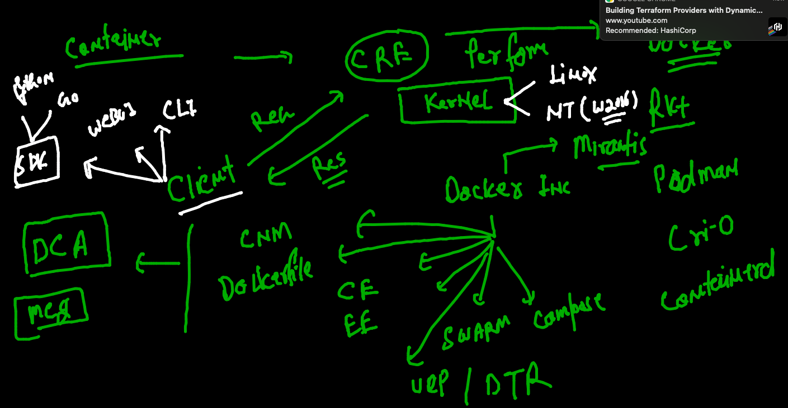

## understanding kubeconfig file 

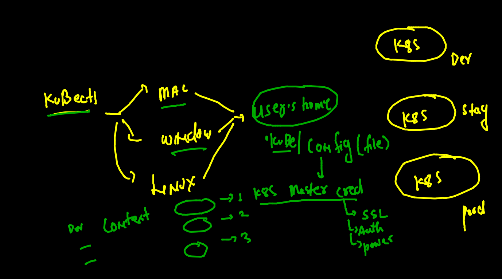

## deleting all the pods 

```
❯ kubectl  delete pods --all
pod "alwth-1" deleted
pod "ashupod-1" deleted
pod "debapod-1" deleted
pod "my-release-kubernetes-dashboard-57795fc766-j5mjp" deleted
pod "nishpod-1" deleted
pod "rubipod-1" deleted
pod "shubhampod1" deleted
pod "tejpod-1" deleted

```

### generating yaml 

```
❯ kubectl  run  ashwebpod  --image=dockerashu/ciscohttpd:v1   --port 80 --dry-run=client -o yaml
apiVersion: v1
kind: Pod
metadata:
  creationTimestamp: null
  labels:
    run: ashwebpod
  name: ashwebpod
spec:
  containers:
  - image: dockerashu/ciscohttpd:v1
    name: ashwebpod
    ports:
    - containerPort: 80
    resources: {}
  dnsPolicy: ClusterFirst
  restartPolicy: Always
status: {}

```

### deploy yaml file to create pod 

```
❯ kubectl  apply -f  ashweb.yaml
pod/ashwebpod created
❯ kubectl  get  po
NAME                                               READY   STATUS    RESTARTS   AGE
ashwebpod                                          1/1     Running   0          12s
my-release-kubernetes-dashboard-57795fc766-rbqb9   1/1     Running   0          12m
rubiwebpod                                         1/1     Running   0          5s
shubham-pod1   

```

## POd networking is always inside cluster only 

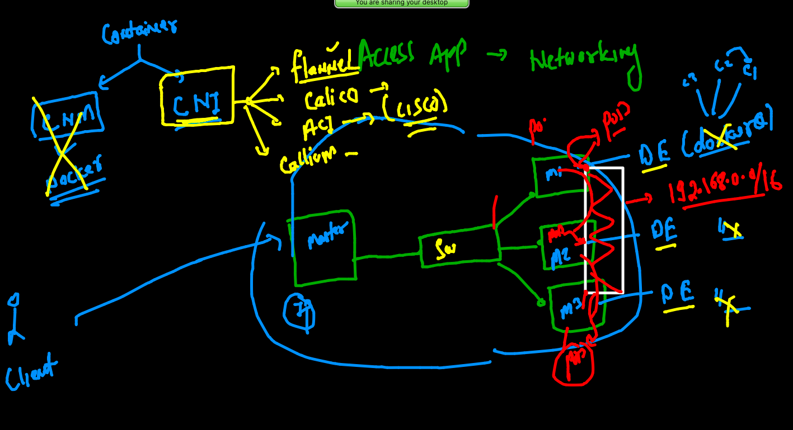

### access pod app from k8s client side -- just for testing purpose 

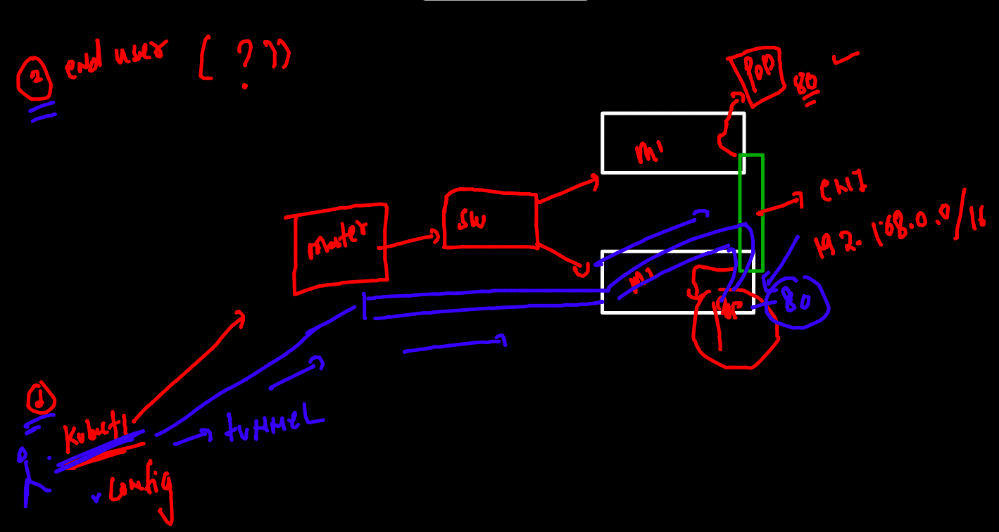

### just one pod 

```
❯ kubectl  port-forward   ashwebpod   1234:80
Forwarding from 127.0.0.1:1234 -> 80
Forwarding from [::1]:1234 -> 80
Handling connection for 1234
Handling connection for 1234
```

### Internal Loadbalancer we to forward traffic to pod 

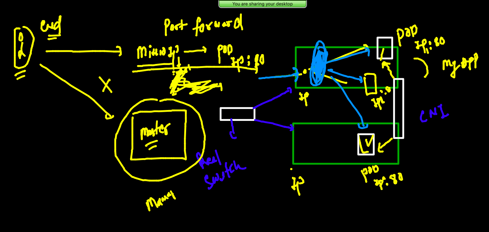

### how svc will access the right pods 

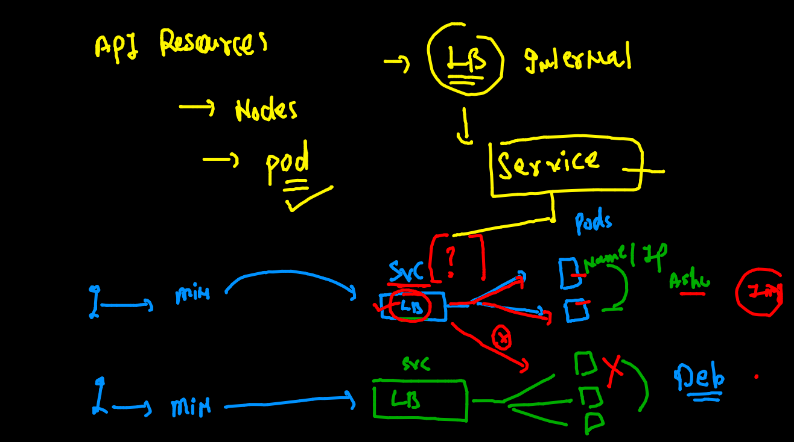

### svc can't use pod name and IP address details to forwarding traffic 

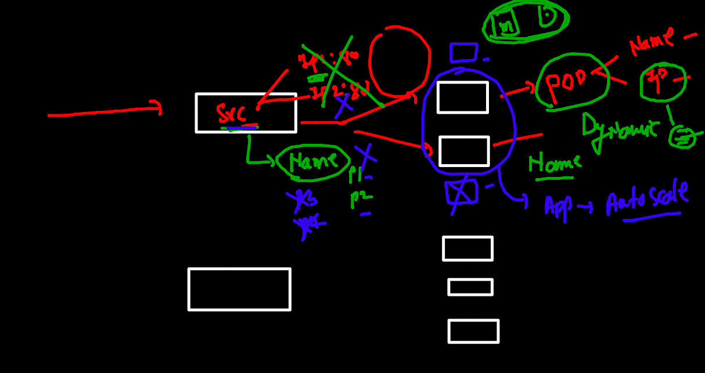

### service will use label to find set of pods 

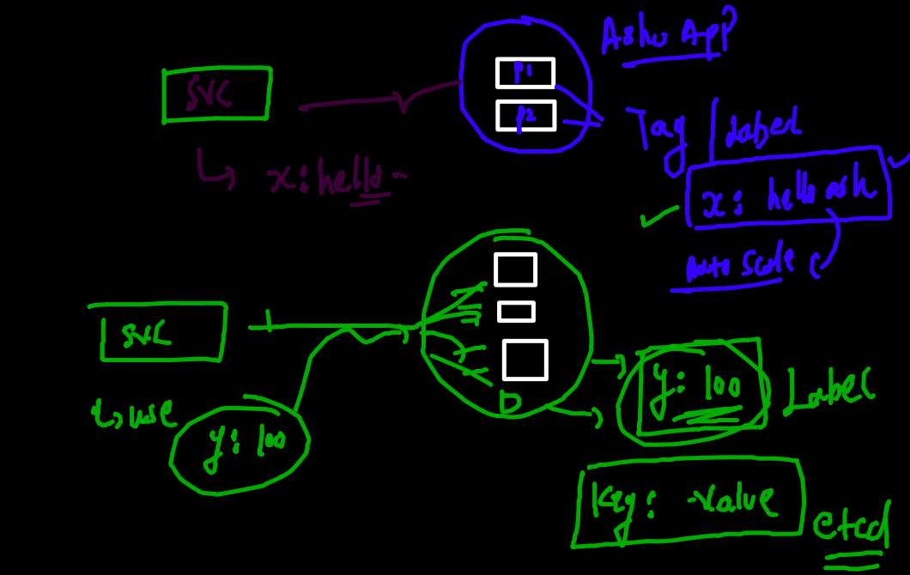

### checking label of pod 

```
❯ kubectl  get  po  ashwebpod  --show-labels
NAME        READY   STATUS    RESTARTS      AGE   LABELS
ashwebpod   1/1     Running   1 (79m ago)   79m   x=helloashu

```

### service type 

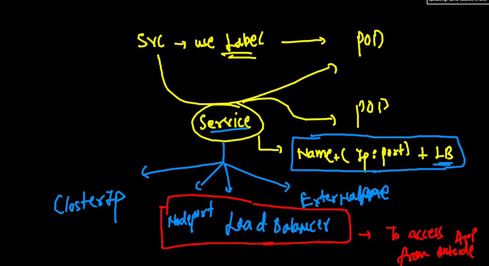

### NodePort service type 

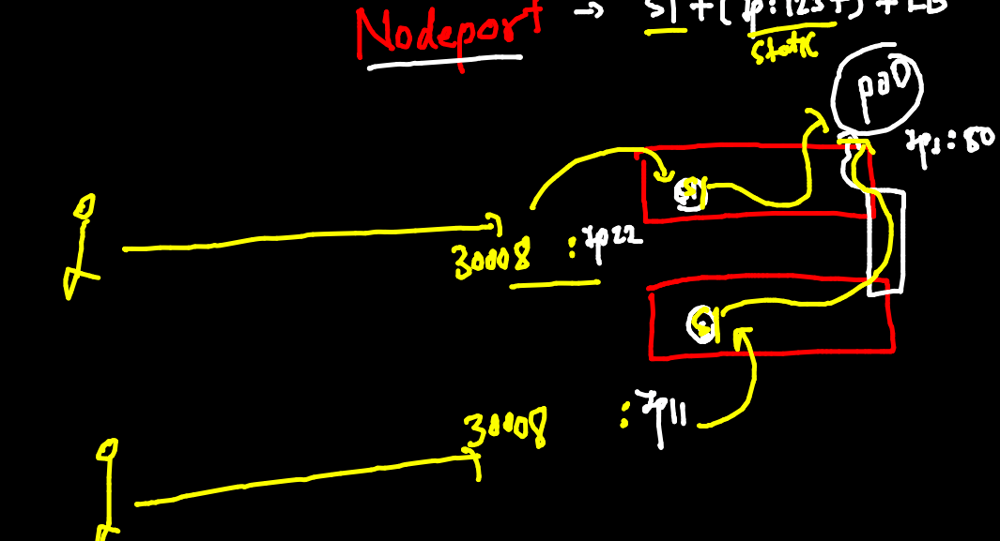

### creating node port service 

```
❯ kubectl  create   service
Create a service using specified subcommand.

Aliases:
service, svc

Available Commands:
  clusterip    Create a ClusterIP service.
  externalname Create an ExternalName service.
  loadbalancer Create a LoadBalancer service.
  nodeport     Create a NodePort service.


====

❯ kubectl  create   service   nodeport  ashusvc1  --tcp  1234:80  --dry-run=client -o yaml
apiVersion: v1
kind: Service
metadata:
  creationTimestamp: null
  labels:
    app: ashusvc1
  name: ashusvc1
spec:
  ports:
  - name: 1234-80
    port: 1234
    protocol: TCP
    targetPort: 80
  selector:
    app: ashusvc1
  type: NodePort
status:
  loadBalancer: {}
❯ kubectl  create   service   nodeport  ashusvc1  --tcp  1234:80  --dry-run=client -o yaml   >ashusvc1.yaml

```

### deploying service

```
❯ kubectl apply -f  ashusvc1.yaml
service/ashusvc1 created
❯ kubectl  get  service
NAME                              TYPE        CLUSTER-IP       EXTERNAL-IP   PORT(S)          AGE
ashusvc1                          NodePort    10.109.244.17    <none>        1234:32154/TCP   5s

```
 
### Deleting all things 

```
 kubectl  delete  all --all
 
```

### namespace concept 


### default namespaces in k8s

```
❯ kubectl  get  po
No resources found in default namespace.
❯ kubectl   get    namespaces
NAME              STATUS   AGE
default           Active   20h
kube-node-lease   Active   20h
kube-public       Active   20h
kube-system       Active   20h

```

###  kube-system namespace data 

```
❯ kubectl  get  po  -n kube-system
NAME                                       READY   STATUS    RESTARTS      AGE
calico-kube-controllers-58497c65d5-ccql9   1/1     Running   1 (19h ago)   20h
calico-node-dg25z                          1/1     Running   1 (19h ago)   20h
calico-node-ht5vc                          1/1     Running   1 (19h ago)   20h
calico-node-rkp5c                          1/1     Running   1 (19h ago)   20h
coredns-78fcd69978-5bfzv                   1/1     Running   1 (19h ago)   20h
coredns-78fcd69978-g9sct                   1/1     Running   1 (19h ago)   20h
etcd-masternode                            1/1     Running   1 (19h ago)   20h
kube-apiserver-masternode                  1/1     Running   1 (19h ago)   20h
kube-controller-manager-masternode         1/1     Running   1 (19h ago)   20h
kube-proxy-qs2wd                           1/1     Running   1 (19h ago)   20h
kube-proxy-v6dfc                           1/1     Running   1 (19h ago)   20h
kube-proxy-zr9jp                           1/1     Running   1 (19h ago)   20h
kube-scheduler-masternode                  1/1     Running   1 (19h ago)   20h
metrics-server-6fb5c69669-2xzc9            1/1     Running   0             4h33m

```

### creating namespace 

```
❯ kubectl  create  namespace  ashu-space
namespace/ashu-space created
❯ kubectl  get  ns
NAME              STATUS   AGE
ashu-space        Active   5s

```

### changing default namespace 

```
❯ kubectl  get  po
No resources found in default namespace.
❯ kubectl  config set-context --current --namespace=ashu-space
Context "kubernetes-admin@kubernetes" modified.
❯ kubectl  get  po
No resources found in ashu-space namespace.

```

### deploy pod and svc 

```
❯ kubectl  apply  -f  ashweb.yaml -f  ashusvc1.yaml
pod/ashwebpod created
service/ashusvc1 created
❯ kubectl  get  po,svc
NAME            READY   STATUS    RESTARTS   AGE
pod/ashwebpod   1/1     Running   0          8s

NAME               TYPE       CLUSTER-IP       EXTERNAL-IP   PORT(S)          AGE
service/ashusvc1   NodePort   10.110.153.199   <none>        1234:31637/TCP   9s


```

### pod is not good approach we will be using deployment 

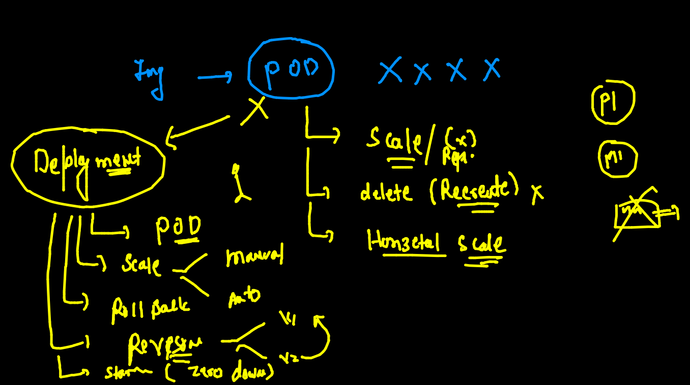

### creating deployment yaml 

```
kubectl  create  deployment  ashudep1  --image=dockerashu/ciscohttpd:v1   --dry-run=client -o yaml 

```

### creating deployment yaml 

```
❯ kubectl  create  deployment  ashudep1  --image=dockerashu/ciscohttpd:v1   --dry-run=client -o yaml
apiVersion: apps/v1
kind: Deployment
metadata:
  creationTimestamp: null
  labels:
    app: ashudep1
  name: ashudep1
spec:
  replicas: 1
  selector:
    matchLabels:
      app: ashudep1
  strategy: {}
  template:
    metadata:
      creationTimestamp: null
      labels:
        app: ashudep1
    spec:
      containers:
      - image: dockerashu/ciscohttpd:v1
        name: ciscohttpd
        resources: {}
status: {}
❯ kubectl  create  deployment  ashudep1  --image=dockerashu/ciscohttpd:v1   --dry-run=client -o yaml   >deploy.yaml

```

### deployed pod 

```
❯ kubectl  apply -f  deploy.yaml
deployment.apps/ashudep1 created
❯ kubectl  get  deployment
NAME       READY   UP-TO-DATE   AVAILABLE   AGE
ashudep1   1/1     1            1           6s
❯ kubectl  get  deploy
NAME       READY   UP-TO-DATE   AVAILABLE   AGE
ashudep1   1/1     1            1           11s
❯ kubectl  get  po
NAME                        READY   STATUS    RESTARTS   AGE
ashudep1-585b55dcf5-dxb9t   1/1     Running   0          16s

```


