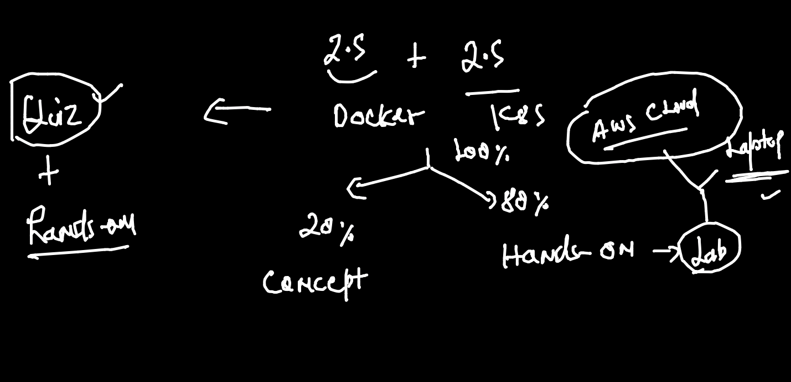
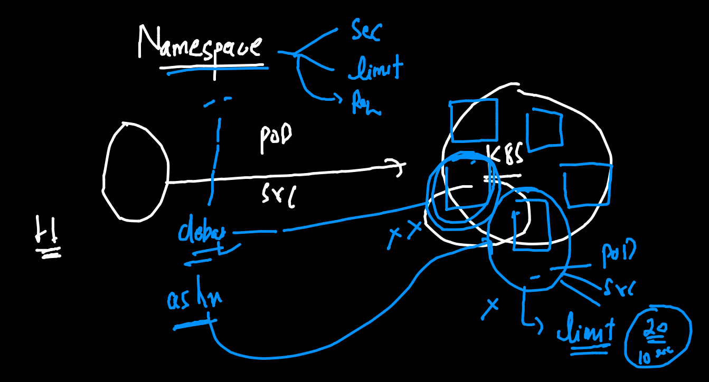
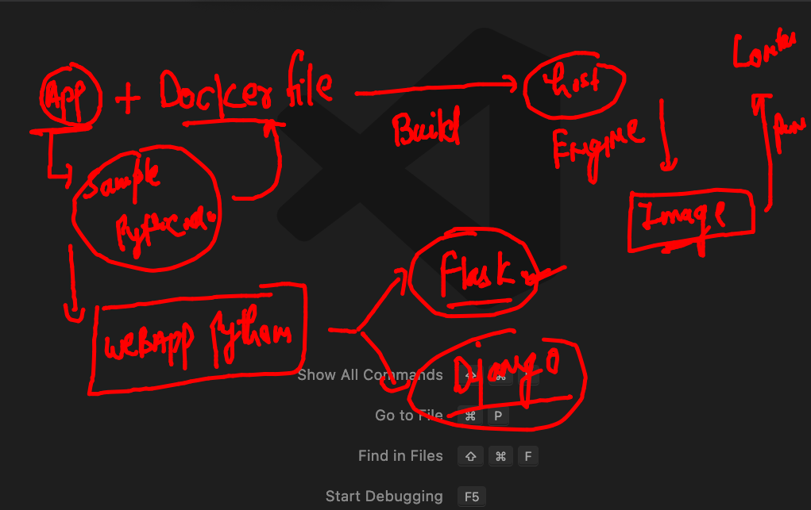
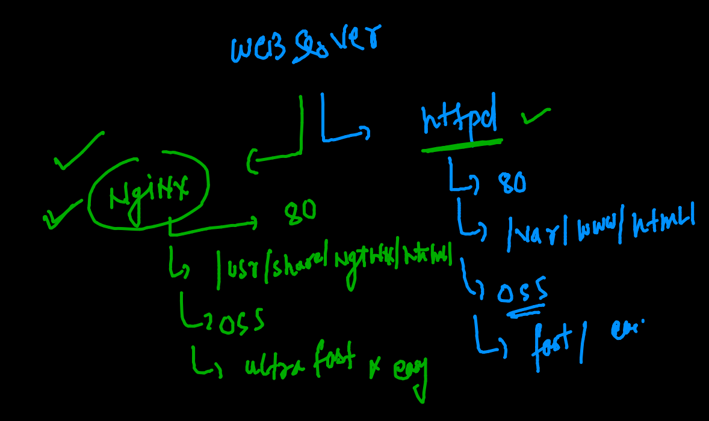
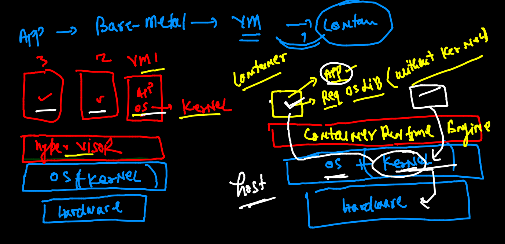
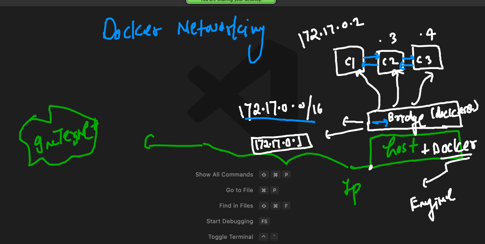
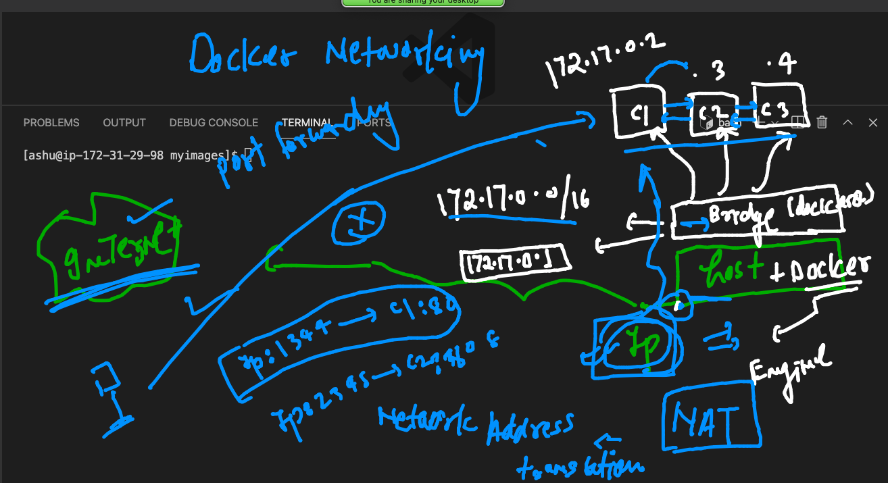

# training plan 



## Namespaces 



## PYthon flask web application -- containerization 



### Cloning flask app 

```
[ashu@ip-172-31-29-98 myimages]$ git clone  https://github.com/redashu/flaskwebappnew
Cloning into 'flaskwebappnew'...
remote: Enumerating objects: 44, done.
remote: Counting objects: 100% (44/44), done.
remote: Compressing objects: 100% (35/35), done.
remote: Total 44 (delta 4), reused 0 (delta 0), pack-reused 0
Receiving objects: 100% (44/44), 162.39 KiB | 11.60 MiB/s, done.
Resolving deltas: 100% (4/4), done.
[ashu@ip-172-31-29-98 myimages]$ ls
flaskwebappnew  pythonapp

```
### building docker image 

```
ashu@ip-172-31-29-98 flaskwebappnew]$ docker  build  -t dockerashu/ciscoflask:v001  .  
Sending build context to Docker daemon  416.8kB
Step 1/8 : FROM centos
 ---> 300e315adb2f
Step 2/8 : LABEL email="ashutoshh@linux.com"
 ---> Running in a737fc5c1e0c
Removing intermediate container a737fc5c1e0c
 ---> 921fb1a3c08f
Step 3/8 : RUN yum  install python3  python3-pip -y
 ---> Running in 8f3b3ccfa941
CentOS Linux 8 - AppStream                       23 MB/s | 8.8 MB     00:00    
CentOS Linux 8 - BaseOS                          18 MB/s | 5.6 MB     00:00    
CentOS Linux 8 - Extras                          11 kB/s |  10 kB     00:00    
Dependencies resolved.
================================================================================
 Package             Arch   Version                             Repo       Size
================================================

```

## sample webapplication front end only 

### Understanding web server 



### httpd web server info before containerizing it 



### cloning the code 

```
[ashu@ip-172-31-29-98 myimages]$ git clone  https://github.com/mdn/beginner-html-site-styled
Cloning into 'beginner-html-site-styled'...
remote: Enumerating objects: 40, done.
remote: Total 40 (delta 0), reused 0 (delta 0), pack-reused 40
Receiving objects: 100% (40/40), 124.07 KiB | 20.68 MiB/s, done.
Resolving deltas: 100% (10/10), done.
[ashu@ip-172-31-29-98 myimages]$ ls
beginner-html-site-styled  flaskwebappnew  pythonapp
[ashu@ip-172-31-29-98 myimages]$ mv  beginner-html-site-styled  samplewebapp
[ashu@ip-172-31-29-98 myimages]$ ls
flaskwebappnew  pythonapp  samplewebapp

```

### building image

```
[ashu@ip-172-31-29-98 samplewebapp]$ docker  build  -t  dockerashu/ciscohttpd:v1 -f httpd.dockerfile   .  
Sending build context to Docker daemon     64kB
Step 1/4 : FROM centos
 ---> 300e315adb2f
Step 2/4 : RUN yum install httpd -y
 ---> Running in ab9d6e1ca1ad
CentOS Linux 8 - AppStream                       24 MB/s | 8.8 MB     00:00    
CentOS Linux 8 - BaseOS                          21 MB/s | 5.6 MB     00:00    
CentOS Linux 8 - Extras                          53 kB/s |  10 kB     00:00    
Last metadata expiration check: 0:00:01 ago on Tue Aug 31 06:19:27 2021.
Dependencies resolved.
======================

```

### creating container 

```
docker  run -itd --name ashuweb -p 1122:80  dockerashu/ciscohttpd:v1 
cb7a67c218637051153196d72b4004864145b5564331a5dd7eaf3354f544944e
[ashu@ip-172-31-29-98 samplewebapp]$ docker  ps
CONTAINER ID   IMAGE                      COMMAND                  CREATED         STATUS         PORTS                                   NAMES
cb7a67c21863   dockerashu/ciscohttpd:v1   "/bin/sh -c 'httpd -…"   5 seconds ago   Up 4 seconds   0.0.0.0:1122->80/tcp, :::1122->80/tcp   ashuweb

```

### testing and pushing image 

```
[ashu@ip-172-31-29-98 samplewebapp]$ docker  login -u dockerashu 
Password: 
WARNING! Your password will be stored unencrypted in /home/ashu/.docker/config.json.
Configure a credential helper to remove this warning. See
https://docs.docker.com/engine/reference/commandline/login/#credentials-store

Login Succeeded
[ashu@ip-172-31-29-98 samplewebapp]$ docker push dockerashu/ciscohttpd:v1
The push refers to repository [docker.io/dockerashu/ciscohttpd]
9d9db49777c3: Pushed 
044a87cebc8f: Pushed 
2653d992f4ef: Mounted from neoshub/ciscohttpd 
v1: digest: sha256:d8a376dbffb48255ff35feb9f40eb1759f416da98a5597ed93e2c1697c02614c size: 950

```

### cgroups 

```
ashu@ip-172-31-29-98 samplewebapp]$ docker  run -itd --name ashuweb12 -p 1120:80  --memory 100m --cpu-shares=30  dockerashu/ciscohttpd:v1  
97b02c257cc494fb747a8a5f123eaae582cdea8fa697aac8f5abe9aeec40d7c8

```

## Docker Networking 



### checking container ip address 

```
176  docker inspect ashuc1 
  177  history 
[ashu@ip-172-31-29-98 myimages]$ docker  exec  -it  ashuc1  sh 
/ # ifconfig 
eth0      Link encap:Ethernet  HWaddr 02:42:AC:11:00:02  
          inet addr:172.17.0.2  Bcast:172.17.255.255  Mask:255.255.0.0
          UP BROADCAST RUNNING MULTICAST  MTU:1500  Metric:1
          RX packets:159 errors:0 dropped:0 overruns:0 frame:0
          TX packets:140 errors:0 dropped:0 overruns:0 carrier:0
          collisions:0 txqueuelen:0 
          RX bytes:14562 (14.2 KiB)  TX bytes:13264 (12.9 KiB)

lo        Link encap:Local Loopback  
          inet addr:127.0.0.1  Mask:255.0.0.0
          UP LOOPBACK RUNNING  MTU:65536  Metric:1
          RX packets:0 errors:0 dropped:0 overruns:0 frame:0
          TX packets:0 errors:0 dropped:0 overruns:0 carrier:0
          collisions:0 txqueuelen:1000 
          RX bytes:0 (0.0 B)  TX bytes:0 (0.0 B)

/ # exit

```

## nat and port forwarding 




