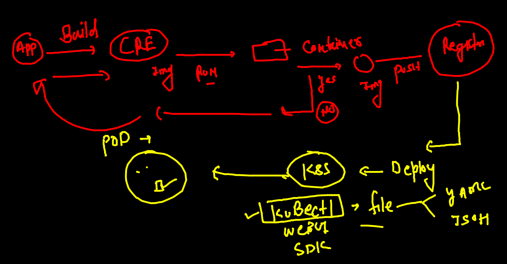

# training plan 


## container app rev 



## understanding kubeconfig file 


## deleting all the pods 

```
❯ kubectl  delete pods --all
pod "alwth-1" deleted
pod "ashupod-1" deleted
pod "debapod-1" deleted
pod "my-release-kubernetes-dashboard-57795fc766-j5mjp" deleted
pod "nishpod-1" deleted
pod "rubipod-1" deleted
pod "shubhampod1" deleted
pod "tejpod-1" deleted

```

### generating yaml 

```
❯ kubectl  run  ashwebpod  --image=dockerashu/ciscohttpd:v1   --port 80 --dry-run=client -o yaml
apiVersion: v1
kind: Pod
metadata:
  creationTimestamp: null
  labels:
    run: ashwebpod
  name: ashwebpod
spec:
  containers:
  - image: dockerashu/ciscohttpd:v1
    name: ashwebpod
    ports:
    - containerPort: 80
    resources: {}
  dnsPolicy: ClusterFirst
  restartPolicy: Always
status: {}

```

### deploy yaml file to create pod 

```
❯ kubectl  apply -f  ashweb.yaml
pod/ashwebpod created
❯ kubectl  get  po
NAME                                               READY   STATUS    RESTARTS   AGE
ashwebpod                                          1/1     Running   0          12s
my-release-kubernetes-dashboard-57795fc766-rbqb9   1/1     Running   0          12m
rubiwebpod                                         1/1     Running   0          5s
shubham-pod1   

```

## POd networking is always inside cluster only 


### access pod app from k8s client side -- just for testing purpose 


### just one pod 

```
❯ kubectl  port-forward   ashwebpod   1234:80
Forwarding from 127.0.0.1:1234 -> 80
Forwarding from [::1]:1234 -> 80
Handling connection for 1234
Handling connection for 1234
```

### Internal Loadbalancer we to forward traffic to pod 


### how svc will access the right pods 


### svc can't use pod name and IP address details to forwarding traffic 


### service will use label to find set of pods 


### checking label of pod 

```
❯ kubectl  get  po  ashwebpod  --show-labels
NAME        READY   STATUS    RESTARTS      AGE   LABELS
ashwebpod   1/1     Running   1 (79m ago)   79m   x=helloashu

```

### service type 


### NodePort service type 


### creating node port service 

```
❯ kubectl  create   service
Create a service using specified subcommand.

Aliases:
service, svc

Available Commands:
  clusterip    Create a ClusterIP service.
  externalname Create an ExternalName service.
  loadbalancer Create a LoadBalancer service.
  nodeport     Create a NodePort service.


====

❯ kubectl  create   service   nodeport  ashusvc1  --tcp  1234:80  --dry-run=client -o yaml
apiVersion: v1
kind: Service
metadata:
  creationTimestamp: null
  labels:
    app: ashusvc1
  name: ashusvc1
spec:
  ports:
  - name: 1234-80
    port: 1234
    protocol: TCP
    targetPort: 80
  selector:
    app: ashusvc1
  type: NodePort
status:
  loadBalancer: {}
❯ kubectl  create   service   nodeport  ashusvc1  --tcp  1234:80  --dry-run=client -o yaml   >ashusvc1.yaml

```

### deploying service

```
❯ kubectl apply -f  ashusvc1.yaml
service/ashusvc1 created
❯ kubectl  get  service
NAME                              TYPE        CLUSTER-IP       EXTERNAL-IP   PORT(S)          AGE
ashusvc1                          NodePort    10.109.244.17    <none>        1234:32154/TCP   5s

```
 
### Deleting all things 

```
 kubectl  delete  all --all
 
```


