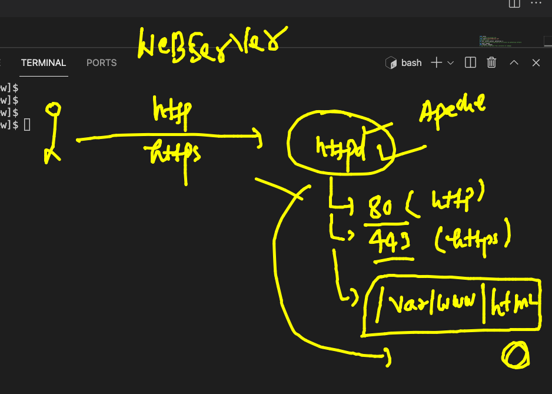

# training plan 


## Namespaces 


## PYthon flask web application -- containerization 


### Cloning flask app 

```
[ashu@ip-172-31-29-98 myimages]$ git clone  https://github.com/redashu/flaskwebappnew
Cloning into 'flaskwebappnew'...
remote: Enumerating objects: 44, done.
remote: Counting objects: 100% (44/44), done.
remote: Compressing objects: 100% (35/35), done.
remote: Total 44 (delta 4), reused 0 (delta 0), pack-reused 0
Receiving objects: 100% (44/44), 162.39 KiB | 11.60 MiB/s, done.
Resolving deltas: 100% (4/4), done.
[ashu@ip-172-31-29-98 myimages]$ ls
flaskwebappnew  pythonapp

```
### building docker image 

```
ashu@ip-172-31-29-98 flaskwebappnew]$ docker  build  -t dockerashu/ciscoflask:v001  .  
Sending build context to Docker daemon  416.8kB
Step 1/8 : FROM centos
 ---> 300e315adb2f
Step 2/8 : LABEL email="ashutoshh@linux.com"
 ---> Running in a737fc5c1e0c
Removing intermediate container a737fc5c1e0c
 ---> 921fb1a3c08f
Step 3/8 : RUN yum  install python3  python3-pip -y
 ---> Running in 8f3b3ccfa941
CentOS Linux 8 - AppStream                       23 MB/s | 8.8 MB     00:00    
CentOS Linux 8 - BaseOS                          18 MB/s | 5.6 MB     00:00    
CentOS Linux 8 - Extras                          11 kB/s |  10 kB     00:00    
Dependencies resolved.
================================================================================
 Package             Arch   Version                             Repo       Size
================================================

```

## sample webapplication front end only 

### Understanding web server 


### httpd web server info before containerizing it 



### cloning the code 

```
[ashu@ip-172-31-29-98 myimages]$ git clone  https://github.com/mdn/beginner-html-site-styled
Cloning into 'beginner-html-site-styled'...
remote: Enumerating objects: 40, done.
remote: Total 40 (delta 0), reused 0 (delta 0), pack-reused 40
Receiving objects: 100% (40/40), 124.07 KiB | 20.68 MiB/s, done.
Resolving deltas: 100% (10/10), done.
[ashu@ip-172-31-29-98 myimages]$ ls
beginner-html-site-styled  flaskwebappnew  pythonapp
[ashu@ip-172-31-29-98 myimages]$ mv  beginner-html-site-styled  samplewebapp
[ashu@ip-172-31-29-98 myimages]$ ls
flaskwebappnew  pythonapp  samplewebapp

```

### building image

```
[ashu@ip-172-31-29-98 samplewebapp]$ docker  build  -t  dockerashu/ciscohttpd:v1 -f httpd.dockerfile   .  
Sending build context to Docker daemon     64kB
Step 1/4 : FROM centos
 ---> 300e315adb2f
Step 2/4 : RUN yum install httpd -y
 ---> Running in ab9d6e1ca1ad
CentOS Linux 8 - AppStream                       24 MB/s | 8.8 MB     00:00    
CentOS Linux 8 - BaseOS                          21 MB/s | 5.6 MB     00:00    
CentOS Linux 8 - Extras                          53 kB/s |  10 kB     00:00    
Last metadata expiration check: 0:00:01 ago on Tue Aug 31 06:19:27 2021.
Dependencies resolved.
======================

```

### creating container 

```
docker  run -itd --name ashuweb -p 1122:80  dockerashu/ciscohttpd:v1 
cb7a67c218637051153196d72b4004864145b5564331a5dd7eaf3354f544944e
[ashu@ip-172-31-29-98 samplewebapp]$ docker  ps
CONTAINER ID   IMAGE                      COMMAND                  CREATED         STATUS         PORTS                                   NAMES
cb7a67c21863   dockerashu/ciscohttpd:v1   "/bin/sh -c 'httpd -…"   5 seconds ago   Up 4 seconds   0.0.0.0:1122->80/tcp, :::1122->80/tcp   ashuweb

```

### testing and pushing image 

```
[ashu@ip-172-31-29-98 samplewebapp]$ docker  login -u dockerashu 
Password: 
WARNING! Your password will be stored unencrypted in /home/ashu/.docker/config.json.
Configure a credential helper to remove this warning. See
https://docs.docker.com/engine/reference/commandline/login/#credentials-store

Login Succeeded
[ashu@ip-172-31-29-98 samplewebapp]$ docker push dockerashu/ciscohttpd:v1
The push refers to repository [docker.io/dockerashu/ciscohttpd]
9d9db49777c3: Pushed 
044a87cebc8f: Pushed 
2653d992f4ef: Mounted from neoshub/ciscohttpd 
v1: digest: sha256:d8a376dbffb48255ff35feb9f40eb1759f416da98a5597ed93e2c1697c02614c size: 950

```

### cgroups 

```
ashu@ip-172-31-29-98 samplewebapp]$ docker  run -itd --name ashuweb12 -p 1120:80  --memory 100m --cpu-shares=30  dockerashu/ciscohttpd:v1  
97b02c257cc494fb747a8a5f123eaae582cdea8fa697aac8f5abe9aeec40d7c8

```

## Docker Networking 


### checking container ip address 

```
176  docker inspect ashuc1 
  177  history 
[ashu@ip-172-31-29-98 myimages]$ docker  exec  -it  ashuc1  sh 
/ # ifconfig 
eth0      Link encap:Ethernet  HWaddr 02:42:AC:11:00:02  
          inet addr:172.17.0.2  Bcast:172.17.255.255  Mask:255.255.0.0
          UP BROADCAST RUNNING MULTICAST  MTU:1500  Metric:1
          RX packets:159 errors:0 dropped:0 overruns:0 frame:0
          TX packets:140 errors:0 dropped:0 overruns:0 carrier:0
          collisions:0 txqueuelen:0 
          RX bytes:14562 (14.2 KiB)  TX bytes:13264 (12.9 KiB)

lo        Link encap:Local Loopback  
          inet addr:127.0.0.1  Mask:255.0.0.0
          UP LOOPBACK RUNNING  MTU:65536  Metric:1
          RX packets:0 errors:0 dropped:0 overruns:0 frame:0
          TX packets:0 errors:0 dropped:0 overruns:0 carrier:0
          collisions:0 txqueuelen:1000 
          RX bytes:0 (0.0 B)  TX bytes:0 (0.0 B)

/ # exit

```

## nat and port forwarding 


## Container Networking 


### Docker networking  bridges


### checking br 

```
[ashu@ip-172-31-29-98 myimages]$ docker  network  ls
NETWORK ID     NAME      DRIVER    SCOPE
14574d07ab7e   bridge    bridge    local
831f87d85925   host      host      local
ecb269f5e134   none      null      local

```

### 

```
[ashu@ip-172-31-29-98 myimages]$ docker  network   inspect  14574d07ab7e 
[
    {
        "Name": "bridge",
        "Id": "14574d07ab7ed83aadbe751d8f58f22f101dc05943a7b9d4fae39fd6816175fb",
        "Created": "2021-08-31T03:56:11.753846674Z",
        "Scope": "local",
        "Driver": "bridge",
        "EnableIPv6": false,
        "IPAM": {
            "Driver": "default",
            "Options": null,
            "Config": [
                {
                    "Subnet": "172.17.0.0/16",
                    "Gateway": "172.17.0.1"
                }
                
                
```

### probelm with default docker bridge 


### creating bridge 

```
[ashu@ip-172-31-29-98 myimages]$ docker  network  create  ashubr1
2b7541c328e13bdfa2320fd4465674e8552bc21293db1a77eea4c25cc34d6bf8
[ashu@ip-172-31-29-98 myimages]$ docker  network  ls
NETWORK ID     NAME      DRIVER    SCOPE
2b7541c328e1   ashubr1   bridge    local
14574d07ab7e   bridge    bridge    local
831f87d85925   host      host      local
ecb269f5e134   none      null      local

```

### container in custom bridge 

```
[ashu@ip-172-31-29-98 myimages]$ docker  run -itd  --name ashuc22  --network  ashubr1  alpine ping localhost 
b393f07df8096252c308e5df3b81b5b6006ad8a0bd7cf13bb3928aa3241ccd3b

```
### inspecting container json information 

```
199  docker  inspect  ashuc22  --format='{{.Id}}'
  200  docker  inspect  ashuc22  --format='{{.State.Status}}'
  201  docker  inspect  ashuc22  --format='{{.NetworkSettings.Networks.ashubr1.IPAddress}}' 
  202  history 
[ashu@ip-172-31-29-98 myimages]$ docker  inspect  ashuc22  --format='{{.NetworkSettings.Networks.ashubr1.IPAddress}}' 
172.18.0.2


```

### container commm by name 

```
[ashu@ip-172-31-29-98 myimages]$ docker  exec  -it ashuc22  sh 
/ # ping  ashu33
PING ashu33 (172.18.0.3): 56 data bytes
64 bytes from 172.18.0.3: seq=0 ttl=255 time=0.121 ms
64 bytes from 172.18.0.3: seq=1 ttl=255 time=0.107 ms
64 bytes from 172.18.0.3: seq=2 ttl=255 time=0.100 ms
64 bytes from 172.18.0.3: seq=3 ttl=255 time=0.094 ms
^C

```

### custom bridge with custom subnet 

```
 216  docker  network  create ashubr2 --subnet  192.168.100.0/24 
  217  docker  run -tid --name ashucc44  --network  ashubr2 alpine ping localhost 
  218  docker  run -tid --name ashucc55 --ip  192.168.100.123   --network  ashubr2 alpine ping localhost 
  
```


### remove all unused network 

```
[ashu@ip-172-31-29-98 myimages]$ docker  network prune 
WARNING! This will remove all custom networks not used by at least one container.
Are you sure you want to continue? [y/N] y
Deleted Networks:
jaya
ashubr2
ashubr1
ruthangabr1
shubham1
debasish
alwthomabr
nishbr1
krishna
shbr1
tejbr1

```

### Docker storage 


## engine store conf location 


```
[root@ip-172-31-29-98 ~]# cd  /var/lib/docker/
[root@ip-172-31-29-98 docker]# ls
buildkit  containers  image  network  overlay2  plugins  runtimes  swarm  tmp  trust  volumes
[root@ip-172-31-29-98 docker]# cd  /etc/sysconfig/
[root@ip-172-31-29-98 sysconfig]# ls
acpid       clock     docker          irqbalance  netconsole       raid-check     rpc-rquotad  selinux
atd         console   docker-storage  keyboard    network          rdisc          rsyncd       sshd
authconfig  cpupower  i18n            man-db      network-scripts  readonly-root  rsyslog      sysstat
chronyd     crond     init            modules     nfs              rpcbind        run-parts    sysstat.ioconf
[root@ip-172-31-29-98 sysconfig]# cat  docker-storage 
# This file may be automatically generated by an installation program.

# By default, Docker uses a loopback-mounted sparse file in
# /var/lib/docker.  The loopback makes it slower, and there are some
# restrictive defaults, such as 100GB max storage.

# If your installation did not set a custom storage for Docker, you
# may do it below.

# Example: Use a custom pair of raw logical volumes (one for metadata,
# one for data).
# DOCKER_STORAGE_OPTIONS="--storage-opt dm.metadatadev=/dev/myvg/my-docker-metadata --storage-opt dm.datadev=/dev/myvg/my-docker-
data"

DOCKER_STORAGE_OPTIONS=
[root@ip-172-31-29-98 sysconfig]# 

```

### creating volume 

```
[ashu@ip-172-31-29-98 myimages]$ docker  volume create  ashuvol1
ashuvol1
[ashu@ip-172-31-29-98 myimages]$ docker volume  ls
DRIVER    VOLUME NAME
local     ashuvol1
[ashu@ip-172-31-29-98 myimages]$ docker volume  ls
DRIVER    VOLUME NAME
local     ashuvol1
local     rubivol1
local     shubvol1

```

### creating container with volume 

```
ashu@ip-172-31-29-98 myimages]$ docker  run -itd  --name ashuc1 -v  ashuvol1:/mydata:rw  alpine  
e8f9c4e9a4d302104fe079b589c7b0b6b737f7db2d5f8eb0bfec59d5002a6176
[ashu@ip-172-31-29-98 myimages]$ docker  ps
CONTAINER ID   IMAGE     COMMAND     CREATED          STATUS          PORTS     NAMES
380f9ff20af8   alpine    "/bin/sh"   9 seconds ago    Up 8 seconds              rubic1
e8f9c4e9a4d3   alpine    "/bin/sh"   13 seconds ago   Up 12 seconds             ashuc1

```

### storing data in volume 

```
[ashu@ip-172-31-29-98 myimages]$ docker  exec  -it  ashuc1  sh 
/ # ls
bin     etc     lib     mnt     opt     root    sbin    sys     usr
dev     home    media   mydata  proc    run     srv     tmp     var
/ # cd  /mydata
/mydata # ls
/mydata # mkdir hii
/mydata # echo hello  >a.txt
/mydata # ls
a.txt  hii

```

### 

```
[ashu@ip-172-31-29-98 myimages]$ docker run -it --name  myc1 -v  ashuvol1:/newdata:ro  centos 
[root@766000df27d1 /]# 
[root@766000df27d1 /]# 
[root@766000df27d1 /]# cd  /newdata/
[root@766000df27d1 newdata]# ls
a.txt  hii
[root@766000df27d1 newdata]# mkdir hiii
mkdir: cannot create directory 'hiii': Read-only file system
[root@766000df27d1 newdata]# ls
a.txt  hii

```

### webUI in Docker 


### intro to compose 


### more about compose 


### Manual installation of compose 

```
 3  sudo curl -L "https://github.com/docker/compose/releases/download/1.29.2/docker-compose-$(uname -s)-$(uname -m)" -o /us
r/local/bin/docker-compose
    4  sudo chmod +x /usr/local/bin/docker-compose
    5  sudo ln -s /usr/local/bin/docker-compose /usr/bin/docker-compose
    
 ```
 
 ### check compose version 
 
 ```
 [ashu@ip-172-31-29-98 myimages]$ docker-compose -v
docker-compose version 1.29.2, build 5becea4c

```
### running first file 

```
ashu@ip-172-31-29-98 ashucompose1]$ ls
docker-compose.yaml
[ashu@ip-172-31-29-98 ashucompose1]$ docker-compose up -d
Creating network "ashucompose1_ashubrx123" with the default driver
Creating volume "ashucompose1_ashuvol111" with default driver
Creating ashucc11 ... done
[ashu@ip-172-31-29-98 ashucompose1]$ docker-compose ps
  Name         Command       State   Ports
------------------------------------------
ashucc11   ping google.com   Up          

```


