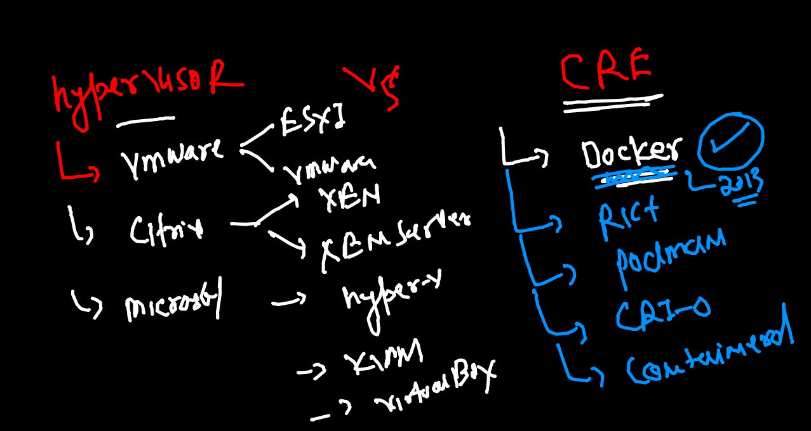

# training plan 


## baremetal 2 vm 


## problem with vm 


## OS understanding 


## Intro to containers 


## hypervisor vs CRE 



## Info about Docker 


## Docker only support LInux and windows based kernel 


## Docker Desktop for MAC 

[Download](https://hub.docker.com/editions/community/docker-ce-desktop-mac)

## Docker Desktop for windows 10

[Download](https://docs.docker.com/desktop/windows/install/)


## Docker arch 


## docker images registry 


## Docker client side basic operations 

```
❯ docker  search   python
NAME                             DESCRIPTION                                     STARS     OFFICIAL   AUTOMATED
python                           Python is an interpreted, interactive, objec…   6467      [OK]       
pypy                             PyPy is a fast, compliant alternative implem…   286       [OK]       
kaggle/python                    Docker image for Python scripts run on Kaggle   155                  [OK]
nikolaik/python-nodejs           Python with Node.js                             80                   [OK]
joyzoursky/python-chromedriver   Python with Chromedriver, for running automa…   58                   [OK]
arm32v7/python                   Python is an interpreted, interactive, objec…   58                   
centos/python-35-centos7         Platform for building and running Python 3.5…   39                   
hylang                           Hy is a Lisp dialect that translates express…   37        [OK]       
centos/python-36-centos7         Platform for building and running Python 3.6…   33                   
arm64v8/python                   Pyt
```


### pulling image from docker hub 

```
❯ docker  pull   alpine
Using default tag: latest
latest: Pulling from library/alpine
a0d0a0d46f8b: Pull complete 
Digest: sha256:e1c082e3d3c45cccac829840a25941e679c25d438cc8412c2fa221cf1a824e6a
Status: Downloaded newer image for alpine:latest
docker.io/library/alpine:latest


```

### checking images on docker on engine 

```
❯ docker   images
REPOSITORY   TAG       IMAGE ID       CREATED      SIZE
alpine       latest    14119a10abf4   2 days ago   5.6MB


```

### from image to container 


### creating a new container 

```
❯ docker  run   --name   ashuc1  -d   alpine:latest    ping  localhost
2e2c11249b2bc81e93e32a456028b08c518243129046b23e70339be3566c7890
```


### checking list of running container only 

```
❯ docker  ps
CONTAINER ID   IMAGE           COMMAND            CREATED          STATUS          PORTS     NAMES
2e2c11249b2b   alpine:latest   "ping localhost"   23 seconds ago   Up 21 seconds             ashuc1

```

### checking output of a container default processs


```
   docker  logs  ashuc1  
 
   docker  logs -f   ashuc1  # live 
 
 ```
 
### docker. stop 

```
❯ docker  stop  2e2c11249b2b
2e2c11249b2b
❯ docker  ps
CONTAINER ID   IMAGE     COMMAND   CREATED   STATUS    PORTS     NAMES

```

### list of all containers 

```
❯ docker  ps -a
CONTAINER ID   IMAGE           COMMAND            CREATED         STATUS                        PORTS     NAMES
2e2c11249b2b   alpine:latest   "ping localhost"   4 minutes ago   Exited (137) 32 seconds ago             ashuc1


```

### starting container 

```
❯ docker  start  ashuc1
ashuc1
❯ docker  ps
CONTAINER ID   IMAGE           COMMAND            CREATED         STATUS         PORTS     NAMES
2e2c11249b2b   alpine:latest   "ping localhost"   6 minutes ago   Up 6 seconds             ashuc1
❯ docker  ps  -a
CONTAINER ID   IMAGE           COMMAND            CREATED         STATUS          PORTS     NAMES
2e2c11249b2b   alpine:latest   "ping localhost"   7 minutes ago   Up 16 seconds             ashuc1

```

#### checking container from inside 

```

❯ docker  exec  -it  ashuc1  sh
/ # 
/ # 
/ # whoami
root
/ # ls  /
bin    dev    etc    home   lib    media  mnt    opt    proc   root   run    sbin   srv    sys    tmp    usr    var
/ # 
/ # ifconfig 
eth0      Link encap:Ethernet  HWaddr 02:42:AC:11:00:02  
          inet addr:172.17.0.2  Bcast:172.17.255.255  Mask:255.255.0.0
          UP BROADCAST RUNNING MULTICAST  MTU:1500  Metric:1
          RX packets:12 errors:0 dropped:0 overruns:0 frame:0
          TX packets:0 errors:0 dropped:0 overruns:0 carrier:0
          collisions:0 txqueuelen:0 
          RX bytes:1016 (1016.0 B)  TX bytes:0 (0.0 B)

lo        Link encap:Local Loopback  
          inet addr:127.0.0.1  Mask:255.0.0.0
          UP LOOPBACK RUNNING  MTU:65536  Metric:1
          RX packets:236 errors:0 dropped:0 overruns:0 frame:0
          TX packets:236 errors:0 dropped:0 overruns:0 carrier:0
          collisions:0 txqueuelen:1000 
          RX bytes:19824 (19.3 KiB)  TX bytes:19824 (19.3 KiB)

/ # exit

```

### remove container 


```
❯ docker kill ashuc1
ashuc1
❯ docker  rm  ashuc1
ashuc1

```
