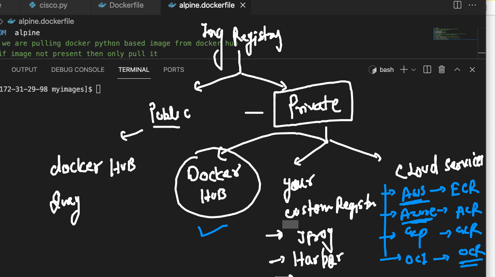

# training plan 


## baremetal 2 vm 


## problem with vm 


## OS understanding 


## Intro to containers 


## hypervisor vs CRE 


## Info about Docker 


## Docker only support LInux and windows based kernel 


## Docker Desktop for MAC 

[Download](https://hub.docker.com/editions/community/docker-ce-desktop-mac)

## Docker Desktop for windows 10

[Download](https://docs.docker.com/desktop/windows/install/)


## Docker arch 


## docker images registry 




## Docker client side basic operations 

```
❯ docker  search   python
NAME                             DESCRIPTION                                     STARS     OFFICIAL   AUTOMATED
python                           Python is an interpreted, interactive, objec…   6467      [OK]       
pypy                             PyPy is a fast, compliant alternative implem…   286       [OK]       
kaggle/python                    Docker image for Python scripts run on Kaggle   155                  [OK]
nikolaik/python-nodejs           Python with Node.js                             80                   [OK]
joyzoursky/python-chromedriver   Python with Chromedriver, for running automa…   58                   [OK]
arm32v7/python                   Python is an interpreted, interactive, objec…   58                   
centos/python-35-centos7         Platform for building and running Python 3.5…   39                   
hylang                           Hy is a Lisp dialect that translates express…   37        [OK]       
centos/python-36-centos7         Platform for building and running Python 3.6…   33                   
arm64v8/python                   Pyt
```


### pulling image from docker hub 

```
❯ docker  pull   alpine
Using default tag: latest
latest: Pulling from library/alpine
a0d0a0d46f8b: Pull complete 
Digest: sha256:e1c082e3d3c45cccac829840a25941e679c25d438cc8412c2fa221cf1a824e6a
Status: Downloaded newer image for alpine:latest
docker.io/library/alpine:latest


```

### checking images on docker on engine 

```
❯ docker   images
REPOSITORY   TAG       IMAGE ID       CREATED      SIZE
alpine       latest    14119a10abf4   2 days ago   5.6MB


```

### from image to container 


### creating a new container 

```
❯ docker  run   --name   ashuc1  -d   alpine:latest    ping  localhost
2e2c11249b2bc81e93e32a456028b08c518243129046b23e70339be3566c7890
```


### checking list of running container only 

```
❯ docker  ps
CONTAINER ID   IMAGE           COMMAND            CREATED          STATUS          PORTS     NAMES
2e2c11249b2b   alpine:latest   "ping localhost"   23 seconds ago   Up 21 seconds             ashuc1

```

### checking output of a container default processs


```
   docker  logs  ashuc1  
 
   docker  logs -f   ashuc1  # live 
 
 ```
 
### docker. stop 

```
❯ docker  stop  2e2c11249b2b
2e2c11249b2b
❯ docker  ps
CONTAINER ID   IMAGE     COMMAND   CREATED   STATUS    PORTS     NAMES

```

### list of all containers 

```
❯ docker  ps -a
CONTAINER ID   IMAGE           COMMAND            CREATED         STATUS                        PORTS     NAMES
2e2c11249b2b   alpine:latest   "ping localhost"   4 minutes ago   Exited (137) 32 seconds ago             ashuc1


```

### starting container 

```
❯ docker  start  ashuc1
ashuc1
❯ docker  ps
CONTAINER ID   IMAGE           COMMAND            CREATED         STATUS         PORTS     NAMES
2e2c11249b2b   alpine:latest   "ping localhost"   6 minutes ago   Up 6 seconds             ashuc1
❯ docker  ps  -a
CONTAINER ID   IMAGE           COMMAND            CREATED         STATUS          PORTS     NAMES
2e2c11249b2b   alpine:latest   "ping localhost"   7 minutes ago   Up 16 seconds             ashuc1

```

#### checking container from inside 

```

❯ docker  exec  -it  ashuc1  sh
/ # 
/ # 
/ # whoami
root
/ # ls  /
bin    dev    etc    home   lib    media  mnt    opt    proc   root   run    sbin   srv    sys    tmp    usr    var
/ # 
/ # ifconfig 
eth0      Link encap:Ethernet  HWaddr 02:42:AC:11:00:02  
          inet addr:172.17.0.2  Bcast:172.17.255.255  Mask:255.255.0.0
          UP BROADCAST RUNNING MULTICAST  MTU:1500  Metric:1
          RX packets:12 errors:0 dropped:0 overruns:0 frame:0
          TX packets:0 errors:0 dropped:0 overruns:0 carrier:0
          collisions:0 txqueuelen:0 
          RX bytes:1016 (1016.0 B)  TX bytes:0 (0.0 B)

lo        Link encap:Local Loopback  
          inet addr:127.0.0.1  Mask:255.0.0.0
          UP LOOPBACK RUNNING  MTU:65536  Metric:1
          RX packets:236 errors:0 dropped:0 overruns:0 frame:0
          TX packets:236 errors:0 dropped:0 overruns:0 carrier:0
          collisions:0 txqueuelen:1000 
          RX bytes:19824 (19.3 KiB)  TX bytes:19824 (19.3 KiB)

/ # exit

```

### remove container 


```
❯ docker kill ashuc1
ashuc1
❯ docker  rm  ashuc1
ashuc1

```


### Remote Docker engine 


## Docker ce intallation on linux 

[check](https://docs.docker.com/engine/install/centos/)

### install and start 

```
[root@ip-172-31-29-98 ~]# yum  install  docker  -y 
Failed to set locale, defaulting to C
Loaded plugins: extras_suggestions, langpacks, priorities, update-motd
amzn2-core                                                                                           | 3.7 kB  00:00:00     

[root@ip-172-31-29-98 ~]# systemctl start  docker  
[root@ip-172-31-29-98 ~]# systemctl status  docker  
● docker.service - Docker Application Container Engine
   Loaded: loaded (/usr/lib/systemd/system/docker.service; enabled; vendor preset: disabled)
   Active: active (running) since Mon 2021-08-30 03:52:14 UTC; 3h 37min ago
     Docs: https://docs.docker.com
  Process: 2850 ExecStartPre=/usr/libexec/docker/docker-setup-runtimes.sh (code=exited, status=0/SUCCESS)
  Process: 2839 ExecStartPre=/bin/mkdir -p /run/docker (code=exited, status=0/SUCCESS)
 Main PID: 2857 (dockerd)
    Tasks: 8
   Memory: 38.1M
   CGroup: /system.slice/docker.service
           └─2857 /usr/bin/dockerd -H fd:// --containerd=/run/containerd/containerd.sock --default-ulimit nofile=32768:65...


```

### app containerization 


### Intro to Dockerfile 


### building python based docker  image

```
ashu@ip-172-31-29-98 pythonapp]$ docker  build  -t   ashupython:ciscov1  . 
Sending build context to Docker daemon  3.072kB
Step 1/6 : FROM  python
latest: Pulling from library/python
4c25b3090c26: Pull complete 
1acf565088aa: Pull complete 
b95c0dd0dc0d: Pull complete 
5cf06daf6561: Pull complete 
942374d5c114: Pull complete 
64c0f10e4cfa: Pull complete 
76571888410b: Pull complete 
5e88ca15437b: Pull complete 
0ab5ec771994: Pull complete 
Digest: sha256:2bd64896cf4ff75bf91a513358457ed09d890715d9aa6bb602323aedbee84d14
Status: Downloaded newer image for python:latest
 ---> 1e76b28bfd4e
Step 2/6 : LABEL name=ashutoshh
 ---> Running in 6dad33be2d71
Removing intermediate container 6dad33be2d71
 ---> 599816948779
Step 3/6 : LABEL email=ashutoshh@linux.com
 ---> Running in dc163385e1d8
Removing intermediate container dc163385e1d8
 ---> 61893a05f555
Step 4/6 : RUN  mkdir /mycode
 ---> Running in a94da7cbfe21
Removing intermediate container a94da7cbfe21
 ---> 9588577ccf60
Step 5/6 : COPY cisco.py  /mycode/cisco.py
 ---> 1b4de2f76e14
Step 6/6 : CMD  ["python","/mycode/cisco.py"]
 ---> Running in 1818bd10c93f
Removing intermediate container 1818bd10c93f
 ---> 4b11844b90da
Successfully built 4b11844b90da
Successfully tagged ashupython:ciscov1


```

### creating container 

```
[ashu@ip-172-31-29-98 pythonapp]$ docker  run -it -d  --name ashupyc1   ashupython:ciscov1   
3423a8aed0e2dd87db00339cdaa87a9040bf1f169b4b925f92af012892aad5dc
[ashu@ip-172-31-29-98 pythonapp]$ docker  ps
CONTAINER ID   IMAGE                COMMAND                  CREATED          STATUS          PORTS     NAMES
6d1fbff00f2c   rubipython:ciscov1   "python /mycode/cisc…"   13 seconds ago   Up 11 seconds             rubic1
3423a8aed0e2   ashupython:ciscov1   "python /mycode/cisc…"   14 seconds ago   Up 12 seconds             ashupyc1
0a3db60637e4   shipython:ciscov1    "python /mycode/cisc…"   25 seconds ago   Up 24 seconds             shipyc1


```

### checking resource consumption 

```
docker  stats   ashupyc1

--- docker  stats 
CONTAINER ID   NAME            CPU %     MEM USAGE / LIMIT    MEM %     NET I/O      BLOCK I/O     PIDS
758521b4b2da   sk1             0.00%     4.816MiB / 7.69GiB   0.06%     850B / 0B    0B / 18.4kB   1
8bbc8d3e3aa8   sanjeevc1       0.00%     4.801MiB / 7.69GiB   0.06%     850B / 0B    0B / 17.4kB   1
28f99c6e37f4   alwthomap1      0.00%     4.82MiB / 7.69GiB    0.06%     920B / 0B    0B / 12.8kB   1
fd2baa349775   krishc1         0.00%     4.84MiB / 7.69GiB    0.06%     850B / 0B    0B / 17.4kB   1
9f1f6f9b8b9d   tejaswinipyc1   0.01%     4.789MiB / 7.69GiB   0.06%     920B / 0B    0B / 17.9kB   1
ec5d2c18bab8   debasish        0.00%     4.852MiB / 7.69GiB   0.06%     920B / 0B    0B / 17.4kB   1
6d1fbff00f2c   rubic1          0.00%   

```

### building same python code in differt way


```
[ashu@ip-172-31-29-98 pythonapp]$ ls
alpine.dockerfile  cisco.py  Dockerfile
[ashu@ip-172-31-29-98 pythonapp]$ docker  build -t  ashupython:alpinev1  -f  alpine.dockerfile  .  
Sending build context to Docker daemon   5.12kB
Step 1/7 : FROM  alpine
 ---> 14119a10abf4
Step 2/7 : LABEL name=ashutoshh
 ---> Running in 8fc6020ff35c
Removing intermediate container 8fc6020ff35c
 ---> ef2de2b9fb42
Step 3/7 : LABEL email=ashutoshh@linux.com
 ---> Running in f329357c5ed5
Removing intermediate container f329357c5ed5
 ---> 9e1ed913a0dc
Step 4/7 : RUN apk add python3
 ---> Running in e0b767216532
fetch https://dl-cdn.alpinelinux.org/alpine/v3.14/main/x86_64/APKINDEX.tar.gz
fetch https://dl-cdn.alpinelinux.org/alpine/v3.14/community/x86_64/APKINDEX.tar.gz
(1/13) Installing libbz2 (1.0.8-r1)
(2/13) Installing expat (2.4.1-r0)
(3/13) Installing libffi (3.3-r2)
(4/13) Installing gdbm (1.19-r0)
(5/13) Installing xz-libs (5.2.5-r0)
(6/13) Installing libgcc (10.3.1_git20210424-r2)
(7/13) Installing libstdc++ (10.3.1_git20210424-r2)
(8/13) Installing mpdecimal (2.5.1-r1)
(9/13) Installing ncurses-terminfo-base (6.2_p20210612-r0)
(10/13) Installing ncurses-libs (6.2_p20210612-r0)
(11/13) Installing readline (8.1.0-r0)
(12/13) Installing sqlite-libs (3.35.5-r0)
(13/13) Installing python3 (3.9.5-r1)
Executing busybox-1.33.1-r3.trigger
OK: 56 MiB in 27 packages
Removing intermediate container e0b767216532
 ---> a29ef98122d4
Step 5/7 : RUN  mkdir /mycode
 ---> Running in d464cadc94cd
Removing intermediate container d464cadc94cd
 ---> 3259d472e8cb
Step 6/7 : COPY cisco.py  /mycode/cisco.py
 ---> 2d77d6408925
Step 7/7 : CMD  ["python3","/mycode/cisco.py"]
 ---> Running in 70442bc05314
Removing intermediate container 70442bc05314
 ---> b8d68074f280
Successfully built b8d68074f280

```

### kill all the running container 
```
[ashu@ip-172-31-29-98 pythonapp]$ docker kill  $(docker  ps  -q) 
2916ecda3684
758521b4b2da
28f99c6e37f4
fd2baa349775
9f1f6f9b8b9d
ec5d2c18bab8
6d1fbff00f2c
3423a8aed0e2


```

### image build 


